# Vue Router 4 學習筆記

主要根據 Vue Router 4 官方文檔整理的學習筆記，方便查閱。

## 官方文檔

> https://router.vuejs.org/ <br> https://router.vuejs.org/zh/

## 目錄

- [安裝 Vue Router](#安裝-vue-router)

- [基礎配置](#基礎配置)

- [操作存取路由](#操作存取路由)

- [動態參數路由](#動態參數路由)

  - [基礎使用](#基礎使用)

  - [多個動態參數](#多個動態參數)

  - [使用自定義正則表達式](#使用自定義正則表達式)

- [命名路由](#命名路由)

- [巢狀路由](#巢狀路由)

- [編程式導航](#編程式導航)

- [命名視圖](#命名視圖)

- [重新導向和別名](#重新導向和別名)

- [傳遞 props 給路由組件](#傳遞-props-給路由組件)

- [Active links](#active-links)

- [不同的歷史模式](#不同的歷史模式)

- [導航守衛](#導航守衛)

  - [全局前置守衛](#全局前置守衛)

  - [全局解析守衛](#全局解析守衛)

  - [全局後置鉤子](#全局後置鉤子)

  - [針對單個路由的守衛](#針對單個路由的守衛)

  - [組件內的守衛](#組件內的守衛)

  - [完整的導航流程](#完整的導航流程)

- [路由元信息](#路由元信息)

- [數據獲取的方式](#數據獲取的方式)

- [router-view 插槽](#router-view-插槽)

- [過渡動畫效果](#過渡動畫效果)

- [滾動行為 (Scroll Behavior)](#滾動行為-scroll-behavior)

- [擴展 router-link](#擴展-router-link)

- [導航結果](#導航結果)

- [動態路由](#動態路由)

## 安裝 Vue Router

### 1. 基於 Vite 創建新專案

在環境安裝時選擇添加使用 Vue Router 即可。

```bash
npm create vue@latest
```

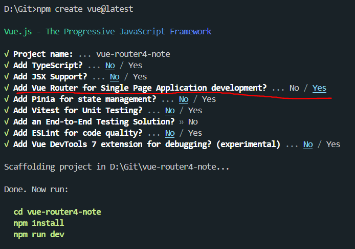

Vue Router 相關文件夾：

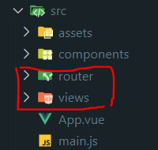

項目運行結果：

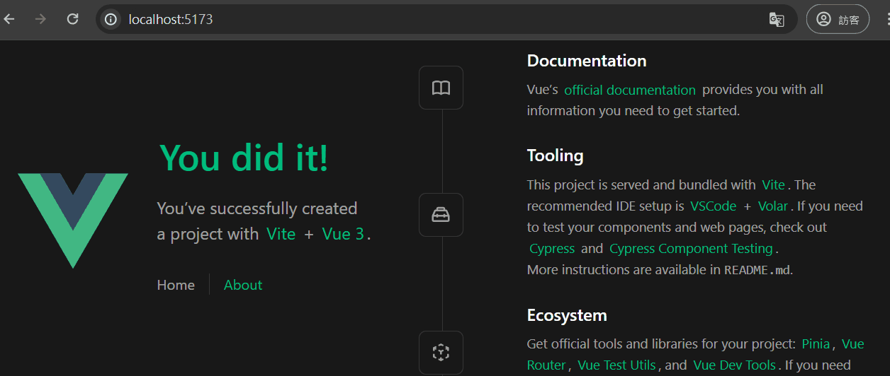

### 2. 現有專案新增安裝

安裝完成後需要自己配置相關文件，參考下面的[基礎配置](#基礎配置)。

```bash
npm install vue-router@4
```

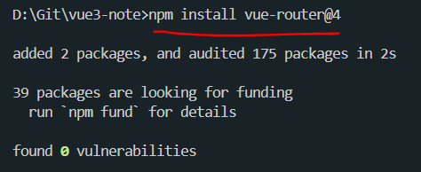

## 基礎配置

### 1. 新增路由頁面文件

在 src 下建立 views 資料夾，通常路由相關的頁面會放置在此。


views 資料夾下新增 Home、About 頁面：

- Home.vue

  ```vue
  <template>
    <h2>Home page</h2>
  </template>
  ```

- About.vue

  ```vue
  <template>
    <h2>About page</h2>
  </template>
  ```

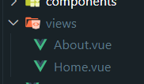

### 2. 創建路由配置文件

在 src 下建立 router 資料夾，並新增 index.js 文件。

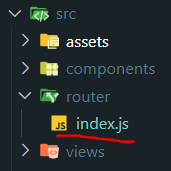

設定路由配置 index.js：

> 動態導入(懶加載)相關介紹可以查看此[官方文檔](https://router.vuejs.org/zh/guide/advanced/lazy-loading.html)。

```javascript
import { createRouter, createWebHistory } from 'vue-router';
// 靜態導入
import Home from '@/views/Home.vue';

// 配置路由規則
const routes = [
  {
    path: '/',
    name: 'Home',
    component: Home,
  },
  {
    path: '/about',
    name: 'About',
    // 動態導入(懶加載)
    component: () => import('@/views/About.vue'),
  },
];

// 創建路由實例
const router = createRouter({
  // 指定模式
  history: createWebHistory(import.meta.env.BASE_URL),
  // 設定前面配置的路由
  routes,
});

// 共享路由實例
export default router;
```

### 3. main.js 引入並使用路由實例

```javascript
import { createApp } from 'vue';
import App from './App.vue';
import router from './router';

const app = createApp(App);

app.use(router);

app.mount('#app');
```

### 4. App.vue 內設定路由連結及顯示

Vue Router 提供了 `<router-link>` 及 `<router-view>` 兩個全域註冊的組件：

- `<router-link>` 組件

  創建路由連結，也可以使用 `<RouterLink>`。

  屬性：

  - to -> 跳轉的路由地址，值為字串或一個物件。

  - replace -> 設置後，會調用 `router.replace()` 而不是 `router.push()`。

    > `replace` 沒有歷史紀錄不可返回，`push` 可以返回。

  - active-class -> 設置連結配對後應用的 class，默認為 `router-link-active`。

  - exact-active-class -> 設置連結準確配對時應用的 class，默認為 `router-link-exact-active`。

- `<router-view>` 組件

  **顯示路由切換頁面的地方**，也可以使用 `<RouterView>`。

設置 App.vue：

```vue
<script setup></script>

<template>
  <h1>Hello Vue Router4!</h1>
  <p><strong>Current route path:</strong> {{ $route.fullPath }}</p>

  <nav>
    <router-link to="/">Go to Home</router-link> |
    <router-link to="/about">Go to About</router-link>
  </nav>

  <main>
    <router-view />
  </main>
</template>
```

> 在模板中也可以透過 `$route` 來獲取當前路由資料。

### 5. 運行專案結果

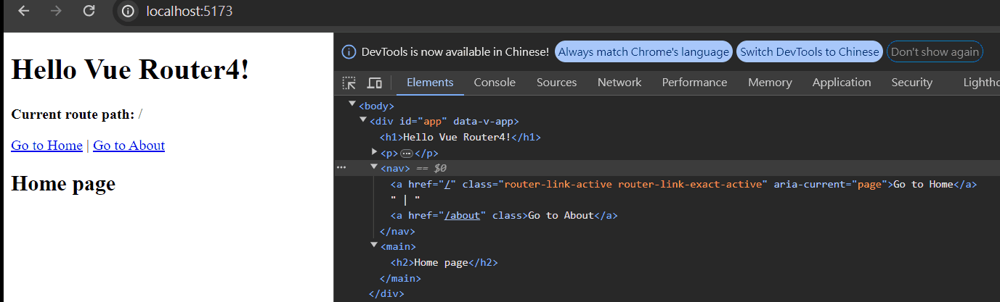

## 操作存取路由

在組件中我們可以透過幾個方法獲取路由實例和當前路由資料。

### 1. `<template>` 模板中

在組件模板中可以透過 `$router`、`$route` 操作存取路由。

- `$router` -> 路由實例，可以用來進行動態的路由操作。

- `$route` -> 包含當前路由資料的物件

About.vue 模板中操作存取路由：

```vue
<template>
  <h2>About page</h2>
  <hr />
  <h3>Current Route Information</h3>
  <p>Path: {{ $route.path }}</p>
  <p>Path: {{ $route.name }}</p>

  <button @click="$router.push('/')">Back to Home</button>
</template>
```

渲染結果：

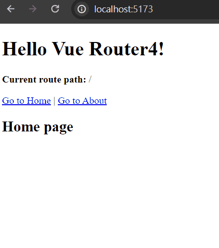

### 2. `<script setup>` 中

在 `<script setup>` 中則可以透過使用 `useRouter()`、`useRoute()` 來執行相同的功能。

- `useRouter()` -> 獲取路由實例，可以用來進行動態的路由操作。

- `useRoute()` -> 返回包含當前路由資料的物件

Home.vue `<script setup>` 中操作存取路由：

```vue
<script setup>
import { useRouter, useRoute } from 'vue-router';

const router = useRouter();
const route = useRoute();
</script>

<template>
  <h2>Home page</h2>
  <hr />
  <h3>Current Route Information</h3>
  <p>Path: {{ route.path }}</p>
  <p>Name: {{ route.name }}</p>

  <button @click="router.push('/about')">Go to About</button>
</template>
```

渲染結果：


## 動態參數路由

當需要在**同一規則的路由中對應到相同的頁面組件**時，例如一個 User 組件會根據不同的 userId 渲染不同的 User 資料，這時候就可以使用動態參數路由來實現。

將路由中動態參數的部分使用 `:` 開頭命名，當路由匹配時，動態參數的值將會透過 `route.params` 暴露給組件使用，取得對應的 `params` 後即可以搭配 API 取得特定資料顯示在頁面上。

### 基礎使用

#### § 1. 動態參數路由配置 (router/index.js)

```javascript
//...

// 配置路由規則
const routes = [
  //...
  {
    path: '/users/:userId',
    name: 'User',
    component: () => import('@/views/User.vue'),
  },
];

//...
```

#### § 2. 設置路由切換 (App.vue)

```vue
<template>
  <!-- 省略前面 -->

  <nav>
    <!-- 省略前面 -->
    <router-link to="/users/1">Go to User 1</router-link> |
    <router-link to="/users/2">Go to User 2</router-link>
  </nav>

  <main>
    <router-view />
  </main>
</template>
```

#### § 3. User.vue 中取得路由動態參數

可以透過前面介紹的[操作存取路由](#操作存取路由)中的路由實例 (`route`) 的 `params` 來獲取對應的動態參數。

```vue
<script setup>
import { useRoute } from 'vue-router';
import { watch, onMounted } from 'vue';

const route = useRoute();

onMounted(() => {
  console.log(`onMounted userId: ${route.params.userId}`);
});

watch(
  () => route.params.userId,
  (newId, oldId) => {
    console.log(`newId: ${newId} , oldId: ${oldId}`);
  }
);
</script>

<template>
  <h2>User page</h2>
  <hr />
  <p>UserId: {{ route.params.userId }}</p>
</template>
```

渲染結果：

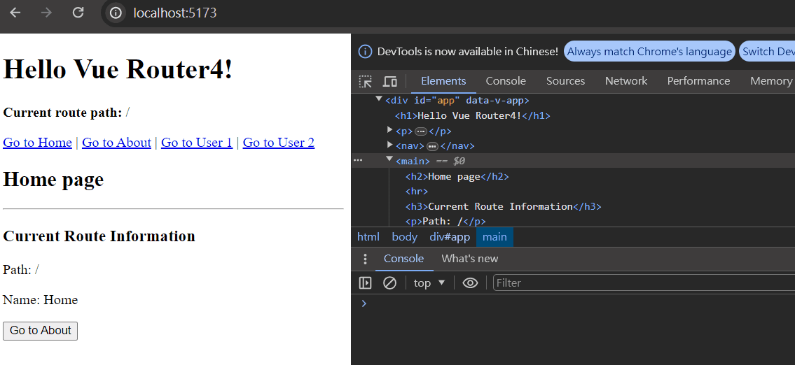

> 需要注意的是，當動態參數路由切換從 /users/1 跳轉至 /users/2 時，**會複用 User 的組件實例並不會進行銷毀，因此生命週期鉤子將不會被再次調用**，若需要獲取 `route` 的變化可以透過 `watch` 來實現 (上面的範例)。

#### § 4. `onBeforeRouteUpdate` 路由導航守衛

除了使用 `watch` 之外，也可以在組件內另外調用 `onBeforeRouteUpdate` 路由導航守衛，來獲取當前路由變化。

> 可以參考[組件內的守衛](#組件內的守衛)。

```vue
<script setup>
import { onBeforeRouteUpdate, useRoute } from 'vue-router';
import { onMounted } from 'vue';

const route = useRoute();

onMounted(() => {
  console.log(`onMounted userId: ${route.params.userId}`);
});

onBeforeRouteUpdate((to, from) => {
  const userId = to.params.userId;
  console.log(`onBeforeRouteUpdate userId: ${userId}`);
});
</script>

<template>
  <h2>User page</h2>
  <hr />
  <p>UserId: {{ route.params.userId }}</p>
</template>
```

渲染結果：

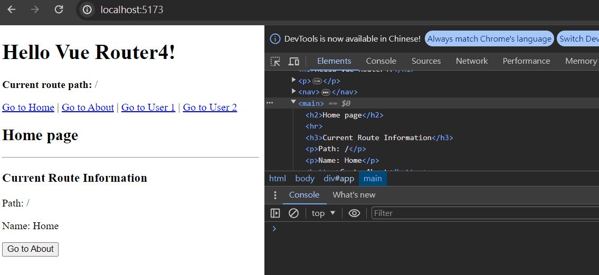

---

### 多個動態參數

也可以設置多個路由動態參數。例如：`/users/:userId/posts/:postId`。

#### § 1. 動態參數路由配置 (router/index.js)

```javascript
//...

// 配置路由規則
const routes = [
  //...
  {
    path: '/users/:userId/posts/:postId',
    name: 'UserPost',
    component: () => import('@/views/UserPost.vue'),
  },
];

//...
```

#### § 2. 設置路由切換 (App.vue)

```vue
<template>
  <!-- 省略前面 -->

  <nav>
    <!-- 省略前面 -->
    <router-link to="/users/1/posts/1">Go to User 1 Post 1</router-link> |
    <router-link to="/users/1/posts/2">Go to User 1 Post 2</router-link>
  </nav>

  <main>
    <router-view />
  </main>
</template>
```

#### § 3. UserPost.vue 中取得路由動態參數

```vue
<template>
  <h3>
    UserId {{ $route.params.userId }} with post {{ $route.params.postId }}
  </h3>
</template>
```

渲染結果：

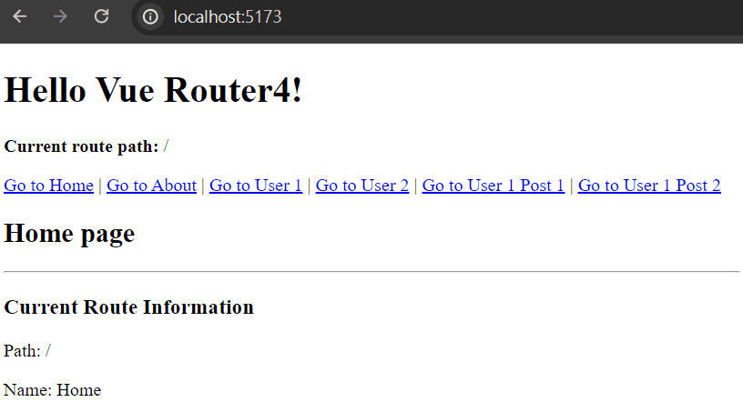

---

### 使用自定義正則表達式

常規的動態參數只匹配 url 片段之間的字符並用 `/` 分隔。如果想匹配**任意路徑**，則需要透過設置動態參數路由**並在參數後的括號中使用自定義正則表達式將其捕獲**。

#### § 設置 404 NotFound 頁面

對於沒有匹配到路由規則的路由，匹配到固定的 NotFound 頁面。

常用寫法：

- `/:pathMatch(.*)`

  可以匹配到不存在的路由地址，通過 `$route.params.pathMatch` 可以獲取傳入的參數值。

- `/:pathMatch(.*)*`

  後面多一個 `*` 代表獲取的 `pathMatch` 會以 `/` 符號為分割符，最後組成一個陣列。

> 注意：路由規則 (routes) 內的順序只有**當路由同時匹配到多個規則時，才是先定義的優先**。

路由配置 (router/index.js)：

```javascript
//...

// 配置路由規則
const routes = [
  //...
  // 設置 404 NotFound 頁面
  {
    path: '/:pathMatch(.*)',
    name: 'NotFound',
    component: () => import('@/views/NotFound.vue'),
  },
];

//...
```

設置頁面 NotFound.vue：

```vue
<script setup>
import { useRoute } from 'vue-router';

const route = useRoute();
</script>

<template>
  <h2>404 Not Found.</h2>
  <p>path: /{{ route.params.pathMatch }}</p>
</template>
```

渲染結果：

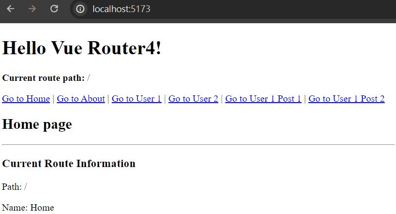

#### § 匹配指定名稱開頭的路由

也可以用相同的寫法設置匹配指定名稱開頭的路由。

以下範例設置匹配 `/user-` 開頭的路由地址，且後面的值會傳入指定的動態參數中(`route.params.afterUser`)。

路由配置 (router/index.js)：

```javascript
//...

// 配置路由規則
const routes = [
  //...
  // 匹配 /user-開頭的路由地址，後面的值傳入 afterUser
  {
    path: '/user-:afterUser(.*)',
    name: 'UserOther',
    component: () => import('@/views/UserOther.vue'),
  },
];

//...
```

設置頁面 UserOther.vue：

```vue
<script setup>
import { useRoute } from 'vue-router';

const route = useRoute();
</script>

<template>
  <h2>UserOther</h2>
  <p>afterUser value: {{ route.params.afterUser }}</p>
</template>
```

渲染結果：

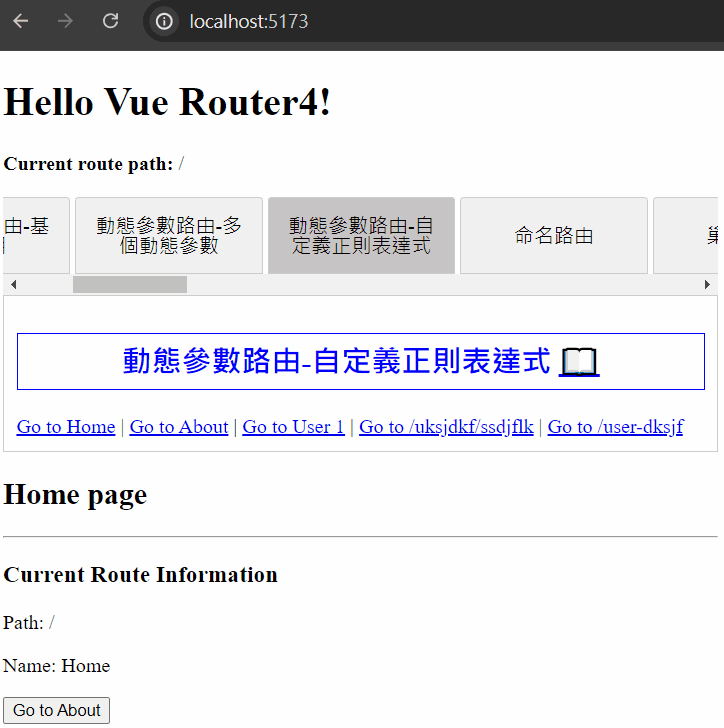

#### § 路由的進階匹配語法

更多的匹配語法可以查看此[官方文檔](https://router.vuejs.org/zh/guide/essentials/route-matching-syntax.html)。

## 命名路由

當設置路由規則時，可以為路由提供 `name` 選項(可選)，**`name` 值必須為唯一值**，若多個路由設定相同的 `name` 值，將只會保留最後一條的設定。

路由規則設置 `name`：

```javascript
//...

// 配置路由規則
const routes = [
  //...
  // 設置 name
  {
    path: '/users/:userId',
    name: 'User',
    component: () => import('@/views/User.vue'),
  },
];

//...
```

連結到指定的命名路由：

可以使用以下兩種方法連結到有命名的路由。

- `<router-link>` 組件的 `to` 屬性：

  可以向 `<router-link>` 組件 `to` 屬性傳遞一個物件，物件內設定 `name` 屬性為指定路由的名稱，也可以設定 `params` 傳遞指定動態參數。

  ```vue
  <template>
    <!-- 省略前面 -->

    <nav>
      <!-- 省略前面 -->
      <router-link :to="{ name: 'User', params: { userId: '1' } }"
        >Go to User 1</router-link
      >
      |
      <router-link :to="{ name: 'User', params: { userId: '2' } }"
        >Go to User 2</router-link
      >
      |
      <!-- 省略 -->
    </nav>

    <main>
      <router-view />
    </main>
  </template>
  ```

- 在 `<script setup>` 內操作路由：

  ```vue
  <script setup>
  import { useRouter } from 'vue-router';

  const router = useRouter();

  function goToUser3() {
    router.push({ name: 'User', params: { userId: '3' } });
  }
  </script>

  <template>
    <!-- 省略前面 -->

    <nav>
      <!-- 省略前面 -->
      <button @click="goToUser3">Go to User 3</button> |
      <!-- 省略 -->
    </nav>

    <main>
      <router-view />
    </main>
  </template>
  ```

渲染結果：

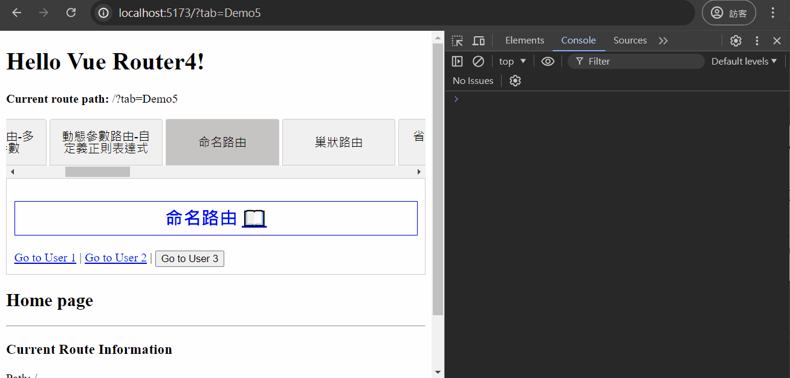

## 巢狀路由

當應用的 UI 由多層的組件組成，通常會需要對應的巢狀結構。例如：`/user/1/profile`、`/user/1/posts`，需要在 User 組件內分別顯示 Profile 和 Posts 組件。

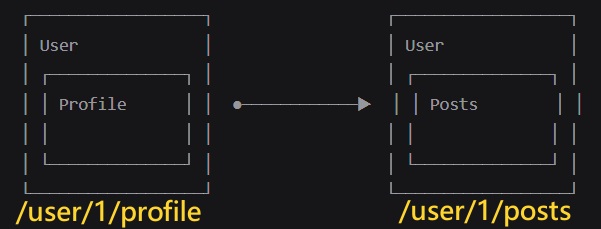

### 基本設定

#### § 1. 添加巢狀路由配置 (router/index.js)

在對應路由中透過添加 `children` 來設定對應的巢狀路由。

```javascript
//...

// 配置路由規則
const routes = [
  //...
  // 設置 children
  {
    path: '/users/:userId',
    name: 'User',
    component: () => import('@/views/User.vue'),
    children: [
      {
        // 當 /user/:userId/profile 時匹配成功
        path: 'profile',
        name: 'UserProfile',
        component: () => import('@/views/UserProfile.vue'),
      },
      {
        // 當 /user/:userId/posts 時匹配成功
        path: 'posts',
        name: 'UserPosts',
        component: () => import('@/views/UserPosts.vue'),
      },
    ],
  },
];

//...
```

> 注意：若巢狀路由以 `/` 開頭，則代表以**根路徑為上層**，這樣可以讓你使用組件嵌套但不需要使用上層組件的 url。

設置頁面 UserProfile.vue：

```vue
<template>
  <h3>User {{ $route.params.userId }} Profile</h3>
</template>
```

設置頁面 UserPosts.vue：

```vue
<template>
  <h3>User {{ $route.params.userId }} Posts</h3>
</template>
```

#### § 2. 組件內添加巢狀路由顯示 (User.vue)

User 組件內可以新添加自己的 `<router-view>` 組件來渲染對應巢狀路由的組件。

```vue
<!-- 省略前面 -->
<template>
  <h2>User page</h2>
  <hr />
  <p>UserId: {{ route.params.userId }}</p>

  <section class="info_wrapper">
    <router-view />
  </section>
</template>

<style scoped>
.info_wrapper {
  border: 1px solid black;
  padding: 10px;
}
</style>
```

#### § 3. 設置路由切換 (App.vue)

```vue
<template>
  <!-- 省略前面 -->

  <nav>
    <!-- 省略前面 -->
    <router-link to="/users/1/profile">Go to User 1 Profile</router-link> |
    <router-link to="/users/1/posts">Go to User 1 Posts</router-link>
  </nav>

  <main>
    <router-view />
  </main>
</template>
```

渲染結果：

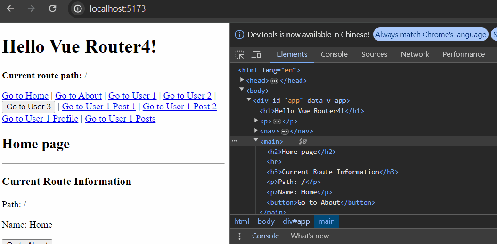

#### § 4. 巢狀路由陣列添加空路徑匹配

此時可以發現訪問 `/users/1` 時，在 User 的 `<router-view>` 內甚麼都不會顯示，這是因為沒有匹配到對應的巢狀路由，如果想要在 `/users/1` 也渲染一些東西，可以設置一個空的巢狀路由來匹配。

**另外需要注意通常巢狀路由的命名都會設置在子路由，這將確保 `/users/:userId` 永遠會顯示對應的巢狀路由。**

```javascript
//...

// 配置路由規則
const routes = [
  //...
  {
    path: '/users/:userId',
    component: () => import('@/views/User.vue'),
    // 命名設置在子路由
    children: [
      {
        // 當 /user/:userId 時匹配成功
        path: '',
        name: 'User',
        component: () => import('@/views/UserHome.vue'),
      },
      {
        // 當 /user/:userId/profile 時匹配成功
        path: 'profile',
        name: 'UserProfile',
        component: () => import('@/views/UserProfile.vue'),
      },
      {
        // 當 /user/:userId/posts 時匹配成功
        path: 'posts',
        name: 'UserPosts',
        component: () => import('@/views/UserPosts.vue'),
      },
    ],
  },
];

//...
```

設置頁面 UserHome.vue：

```vue
<template>
  <h3>User {{ $route.params.userId }} Home</h3>
</template>
```

渲染結果：

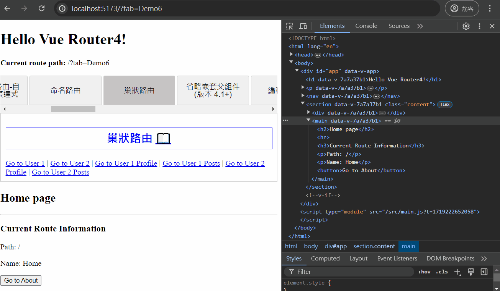

---

### 省略嵌套父組件 (版本 4.1+)

也可以透過**省略嵌套父組件( `component` )的設定，使巢狀路由變成共用的路徑前綴**，方便進行路徑分組或其他更進階的功能。

此時因為未設定嵌套的父組件，因此上一層的 `<router-view>` 會直接以子路由設定的組件替代顯示。

```javascript
//...

// 配置路由規則
const routes = [
  //...
  // 設置共用的路徑前綴
  {
    path: '/admin',
    children: [
      {
        // 當 /admin 時匹配成功
        path: '',
        name: 'AdminOverview',
        component: () => import('@/views/AdminOverview.vue'),
      },
      {
        // 當 /admin/users 時匹配成功
        path: 'users',
        name: 'AdminUserList',
        component: () => import('@/views/AdminUserList.vue'),
      },
      {
        // 當 /admin/users/:id 時匹配成功
        path: 'users/:id',
        name: 'AdminUserDetails',
        component: () => import('@/views/AdminUserDetails.vue'),
      },
    ],
  },
];

//...
```

渲染結果：

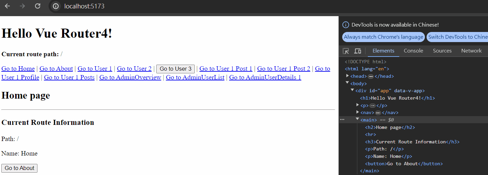

## 編程式導航

除了使用 `<router-link>` 創建 a 標籤來定義導航連結，還可以使用 `router` 的實例方法來進行編程式導航。

以下的範例中的 `router` 皆指代路由器實例，在 `<script setup>` 中則可以通過調用 `useRouter()` 來取得路由器實例。

### 導航到不同的位置

想要導航到不同的 url，可以使用 `router.push` 方法，這個方法會向 `history stack` 添加新的紀錄，因此當使用者點擊瀏覽器的返回鍵時，會回到之前的 url。

一般點擊 `<router-link :to="...">` 的連結時，內部也是調用 `router.push(...)`。而 `push` 方法的參數跟 `<router-link>` 的 `to` 屬性一樣，可以是**一個字串路徑或是一個描述地址的物件**。

```vue
<script setup>
import { useRouter } from 'vue-router';

const router = useRouter();

// 編程式導航
function goToUser4() {
  // 字串路徑
  router.push('/users/4');
}
function goToUser5() {
  // 帶有路徑 (path) 的物件
  router.push({ path: '/users/5' });
}
function goToUser6() {
  // 使用命名路由，並透過 params 添加參數
  router.push({ name: 'User', params: { userId: '6' } });
}
function goToAboutWithQuery() {
  // 透過 query 添加查詢參數，結果為 /about?plan=private
  router.push({ path: '/about', query: { plan: 'private' } });
}
function goToAboutWithHash() {
  // 帶 hash，結果為 /about#team
  router.push({ path: '/about', hash: '#team' });
}
</script>

<template>
  <!-- 省略前面 -->

  <section>
    <p>Programmatic Navigation</p>
    <button @click="goToUser4">Go to User 4</button> |
    <button @click="goToUser5">Go to User 5</button> |
    <button @click="goToUser6">Go to User 6</button> |
    <button @click="goToAboutWithQuery">Go to About With Query</button> |
    <button @click="goToAboutWithHash">Go to About With Hash</button>
  </section>

  <main>
    <router-view />
  </main>
</template>
```

渲染結果：

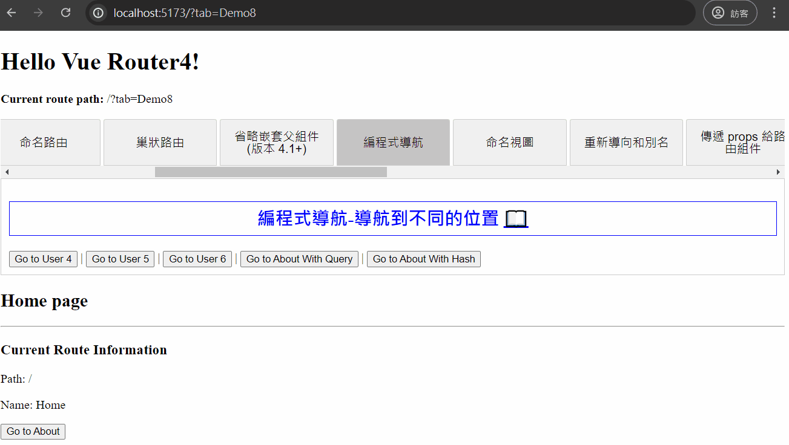

需要特別注意 **`path` 和 `params` 不能同時使用，如果設置了 `path`，`params` 會被忽略**，而 `query` 則不會，因此需要使用命名路由，或是手寫完整帶有參數的 `path`。

```javascript
const userId = '1';
// 手動自己拼接完整的參數 url -> /users/1
router.push(`/users/${userId}`);
// 使用 path ，結果與上方一樣
router.push({ path: `/users/${userId}` });

// 使用命名路由 name 搭配 params -> /users/1
router.push({ name: 'User', params: { userId } });
// path 和 params不能同時使用，會忽略 params -> /users
router.push({ path: '/users', params: { userId } });
```

當指定 `params` 時，可以提供 `string` 或是 `number` 類型的參數 (或者對於 **"可重複的參數"** 可以提供一個陣列)，而提供任何其他類型 (物件、布林等等) 都將被**自動字串化**，而對於**可選參數**則可以提供一個空字串 (`""`) 或 `null` 來移除它。

而 `router.push` 和其他導航方法都會返回一個 `Promise`，讓我們可以等到導航完成後才知道是否成功，以便進行額外的操作( [Navigation Handling](https://router.vuejs.org/zh/guide/advanced/navigation-failures.html) 中會詳細說明)。

> 補充資料：
> [可重複參數](https://router.vuejs.org/zh/guide/essentials/route-matching-syntax.html#%E5%8F%AF%E9%87%8D%E5%A4%8D%E7%9A%84%E5%8F%82%E6%95%B0)、[可選參數](https://router.vuejs.org/zh/guide/essentials/route-matching-syntax.html#%E5%8F%AF%E9%80%89%E5%8F%82%E6%95%B0)。

---

### 替換當前位置

使用 `router.replace` 方法，類似於 `router.push`，但是它不會向 `history stack` 添加新紀錄，而是**直接取代當前的 `history` 紀錄，因此按返回鍵將不會回到當前頁面**。

當 `<router-link>` 設置了 `replace` 時，點擊 `<router-link :to="..." replace>` 的連結，內部會調用`router.replace(...)`。

另外也可以直接在傳遞給 `router.push` 的參數中增加一個屬性 `replace: true`。

```vue
<script setup>
import { useRouter } from 'vue-router';

const router = useRouter();

// 省略...
// 替換當前位置
function goToHomeReplace() {
  // router.push({ path: '/', replace: true });
  // 相當於
  router.replace({ path: '/' });
}
</script>

<template>
  <!-- 省略前面 -->

  <section>
    <p>Programmatic Navigation</p>
    <!-- 省略前面 -->
    <button @click="goToHomeReplace">Go to Home (replace)</button>
  </section>

  <main>
    <router-view />
  </main>
</template>
```

渲染結果：

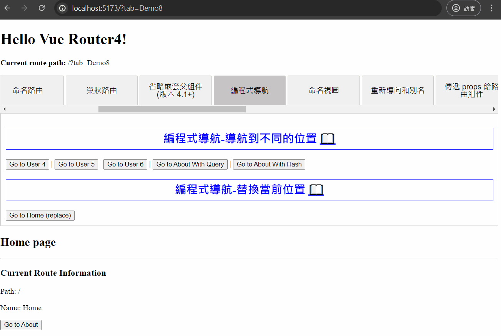

---

### 跨越 history

`router.go` 方法將接收一個整數作為參數，表示在 `history stack` 中前進或後退多少步，類似於 `window.history.go(n)`。

```vue
<script setup>
import { useRouter } from 'vue-router';

const router = useRouter();

// 省略...
// 跨越 history
function forward() {
  // 向前移動一條紀錄，與 router.forward() 相同
  router.go(1);
}
function back() {
  // 返回一條紀錄，與 router.back() 相同
  router.go(-1);
}
function goTo(n) {
  // 如果沒有那麼多的紀錄，會靜默失敗
  router.go(n);
}
</script>

<template>
  <!-- 省略前面 -->

  <section>
    <p>Programmatic Navigation</p>
    <!-- 省略前面 -->
    <button @click="forward">forward</button> |
    <button @click="back">back</button> |
    <button @click="goTo(3)">forward 3</button> |
    <button @click="goTo(-100)">back 100</button> |
    <button @click="goTo(100)">forward 100</button>
  </section>

  <main>
    <router-view />
  </main>
</template>
```

渲染結果：

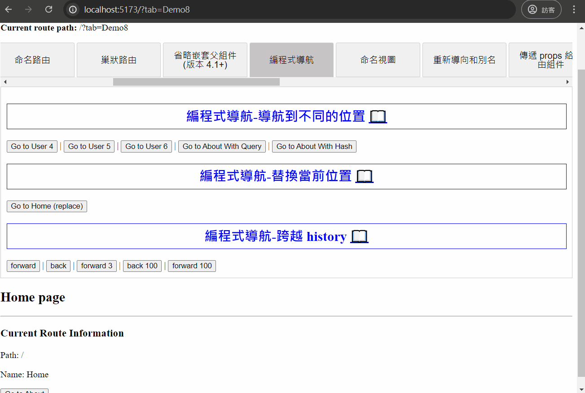

## 命名視圖

有時會需要同時 (同層) 顯示多個視圖，而不是嵌套視圖。例如創建一個布局，有 sidebar (側邊導航)、main (主內容)，**這時候就可以添加多個 `<router-view>` 組件，並為其指定名稱**，若沒有設定名稱則預設名稱為 `default`。

### 基本設定

#### § 1. 新增命名視圖顯示 (App.vue)

```vue
<template>
  <!-- 省略前面 -->

  <nav>
    <!-- 省略前面 -->
    <router-link to="/settings">Go to Settings</router-link>
  </nav>

  <!-- 省略 -->

  <section class="content">
    <div>
      <!-- 命名視圖 -->
      <router-view name="sidebar" />
    </div>
    <main>
      <router-view />
    </main>
  </section>
</template>

<style scoped>
.content {
  display: flex;
}
main {
  flex: 1;
}
</style>
```

#### § 2. 路由配置 (router/index.js)

一個 `<router-view>` 使用一個組件渲染，因此在路由配置時，需要使用 `components` 設定視圖對應的組件 (與 `<router-view>` 上的 `name` 屬性匹配)。

```javascript
//...

// 配置路由規則
const routes = [
  //...
  // 設置命名視圖
  {
    path: '/settings',
    name: 'Settings',
    components: {
      default: () => import('@/views/Settings.vue'),
      sidebar: () => import('@/views/SettingNav.vue'),
    },
  },
  // ...
];

//...
```

設置頁面 Settings.vue：

```vue
<template>
  <h3>Settings</h3>
</template>
```

設置頁面 SettingNav.vue：

```vue
<template>
  <div class="sidebar">
    <h3>SettingNav</h3>
  </div>
</template>

<style scoped>
.sidebar {
  margin-top: 10px;
  margin-right: 10px;
  padding: 10px;
  border: 1px solid black;
  min-height: 50vh;
}
</style>
```

渲染結果：

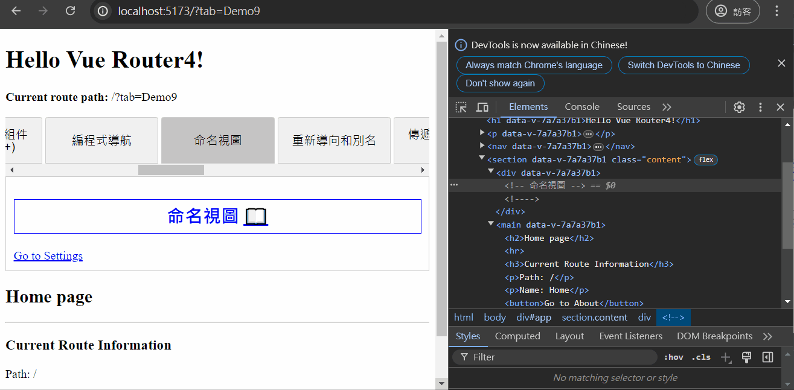

---

### 搭配巢狀路由

當需要複雜的布局時，例如巢狀路由內需要顯示不同的一個或多個視圖，也可以兩者搭配使用。

#### § 1. 新增巢狀視圖顯示 (Settings.vue)

```vue
<template>
  <h3>Settings</h3>
  <router-view />
  <!-- 命名視圖 -->
  <router-view name="helper" />
</template>
```

#### § 2. 設置連結 (SettingNav.vue)

```vue
<template>
  <div class="sidebar">
    <h3>SettingNav</h3>
    <router-link to="/settings/email">email</router-link>
    <router-link to="/settings/profile">profile</router-link>
  </div>
</template>

<style scoped>
.sidebar {
  margin-top: 10px;
  margin-right: 10px;
  padding: 10px;
  border: 1px solid black;
  min-height: 50vh;
  display: flex;
  flex-direction: column;
}
</style>
```

#### § 3. 巢狀路由命名視圖配置 (router/index.js)

在子路由中一樣使用 `components` 指定視圖對應組件即可。

```javascript
//...

// 配置路由規則
const routes = [
  //...
  // 設置命名視圖
  {
    path: '/settings',
    name: 'Settings',
    components: {
      default: () => import('@/views/Settings.vue'),
      sidebar: () => import('@/views/SettingNav.vue'),
    },
    // 巢狀路由
    children: [
      {
        path: 'email',
        name: 'SettingEmail',
        // 顯示 default 視圖
        component: () => import('@/views/SettingEmail.vue'),
      },
      {
        path: 'profile',
        name: 'SettingProfile',
        // 多個視圖顯示
        components: {
          default: () => import('@/views/SettingProfile.vue'),
          helper: () => import('@/views/SettingHelper.vue'),
        },
      },
    ],
  },
  // ...
];

//...
```

設置頁面 SettingEmail.vue：

```vue
<template>
  <div class="wrapper">
    <h3>SettingEmail</h3>
  </div>
</template>

<style scoped>
.wrapper {
  margin-top: 10px;
  padding: 10px;
  border: 1px solid black;
  min-height: 30vh;
}
</style>
```

設置頁面 SettingProfile.vue：

```vue
<template>
  <div class="wrapper">
    <h3>SettingProfile</h3>
  </div>
</template>

<style scoped>
.wrapper {
  margin-top: 10px;
  padding: 10px;
  border: 1px solid black;
  min-height: 30vh;
}
</style>
```

設置頁面 SettingHelper.vue：

```vue
<template>
  <div class="helper">
    <h3>SettingHelper</h3>
  </div>
</template>

<style scoped>
.helper {
  min-height: 10vh;
  padding: 10px;
  background-color: lightblue;
}
</style>
```

渲染結果：

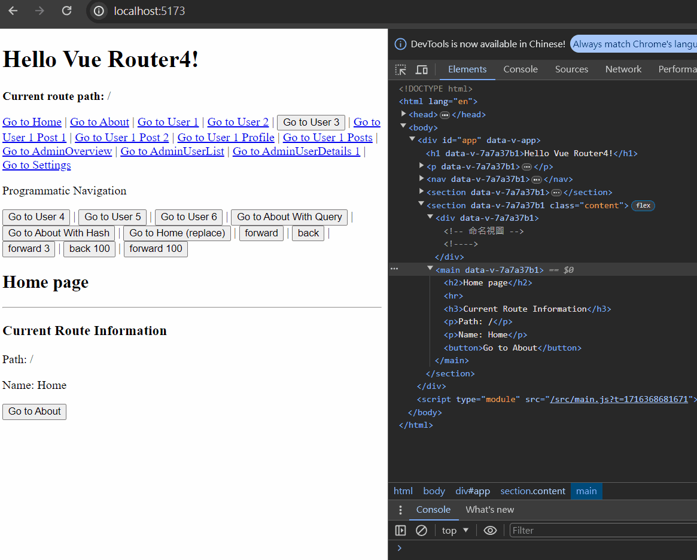

## 重新導向和別名

### 重新導向 redirect

可以通過路由配置來將匹配的路由導向其他目標路由。例如：將 `/home` 重新導向到 `/`。

需要注意的是**導航守衛並不會應用在跳轉路由上**，因此在跳轉路由( `/home` )中添加 `beforeEnter` 守衛不會有任何效果。

#### § 1. 直接指定路由地址

```javascript
//...

// 配置路由規則
const routes = [
  {
    path: '/',
    name: 'Home',
    component: Home,
  },
  // 設置重新導向
  {
    path: '/home',
    redirect: '/',
    // 也可以使用命名路由
    // redirect: { name: 'Home' },
  },
  // ...
];

//...
```

渲染結果：

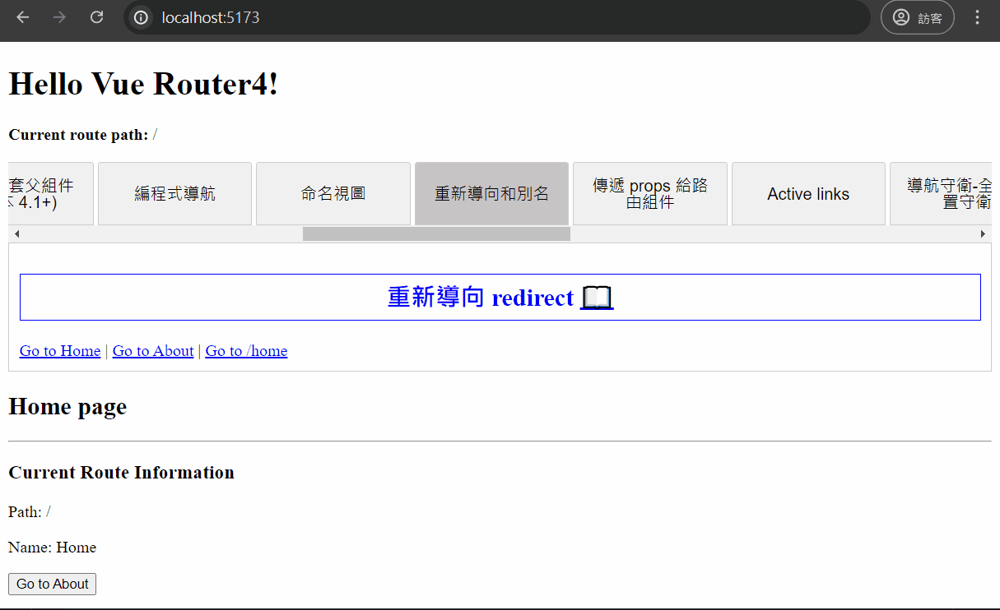

#### § 2. 指定一個方法動態返回重新導向的目標

```javascript
//...

// 配置路由規則
const routes = [
  // ...
  // 指定一個方法動態返回重新導向的目標
  {
    // /search/screens 重新導向 /search?q=screens
    path: '/search/:searchText',
    // 方法會接收目標路由 to 作為參數
    redirect: (to) => {
      // 返回重新導向的路由地址或是一個描述地址的物件
      return { path: '/search', query: { q: to.params.searchText } };
    },
  },
  {
    path: '/search',
    name: 'Search',
    component: () => import('@/views/Search.vue'),
  },
  // ...
];

//...
```

設置頁面 Search.vue：

```vue
<script setup>
import { useRoute } from 'vue-router';

const route = useRoute();
</script>

<template>
  <h2>Search page</h2>
  <hr />
  <p>Query: {{ route.query }}</p>
</template>
```

渲染結果：

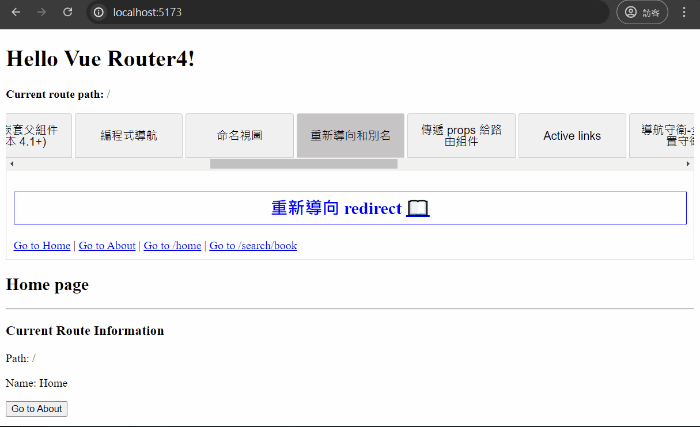

#### § 3. 相對位置重新導向 (不建議使用)

重新導向的路由地址不使用 `/` 開頭時，**會相對當前 url 地址的位置重新導向**。

以下範例設置 `/info` 正常操作可以重新導向到 `/about`，但是當在錯誤的 url 層級操作時則會導致導向不符合預期，因此**建議使用絕對路由地址或是命名路由**明確重新導向的位置。

設置路由配置 (router/index.js)：

```javascript
//...

// 配置路由規則
const routes = [
  // ...
  // 相對位置重新導向 (不建議使用)
  {
    // /info 重新導向到 /about
    path: '/info',
    redirect: 'about',
  },
  {
    path: '/about',
    name: 'About',
    component: () => import('@/views/About.vue'),
  },
  // ...
];

//...
```

設置路由切換 (App.vue)：

```vue
<template>
  <!-- 省略前面 -->

  <nav>
    <!-- 省略前面 -->
    <router-link to="/info">Go to info</router-link>
  </nav>

  <!-- 省略 -->
</template>
```

渲染結果：

可以看到不同的操作可能會導致錯誤的重新導向。

> 可以查看 [github](https://github.com/vuejs/router/issues/2014) 上成員針對相對位置重新導向可能導致的問題的回覆。

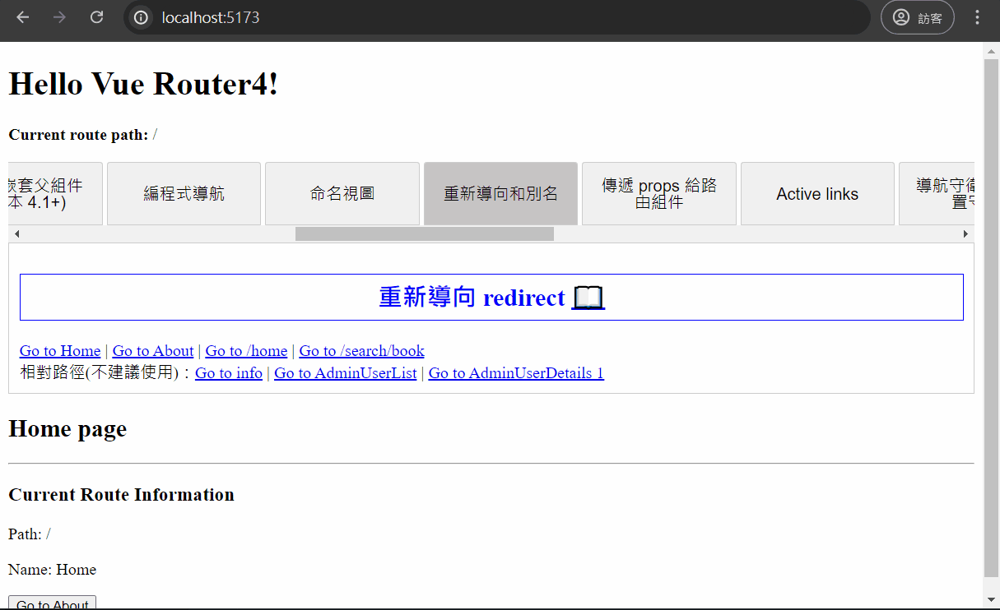

---

### 別名 alias

通過在路由配置中設定別名 `alias`，可以自由的將 UI 結構對應到一個任意的 url，而不需要受嵌套結構的限制。

與重新導向的差別：

`redirect` 是指當使用者訪問 `/home` 時，url 會被 `/` 替換並匹配路由。

而 `alias` 則是將 `/` 別名設置為 `/home2`，當訪問 `/home2` 時，url 仍然是 `/home2`，但是會被匹配為 `/` 的路由設置。

設置路由配置 (router/index.js)：

```javascript
//...

// 配置路由規則
const routes = [
  {
    path: '/',
    name: 'Home',
    component: Home,
    // 設置別名
    alias: '/home2',
  },
  // 設置重新導向
  {
    path: '/home',
    redirect: '/',
  },
  // ...
];

//...
```

渲染結果：

可以看到兩者使用的差別。

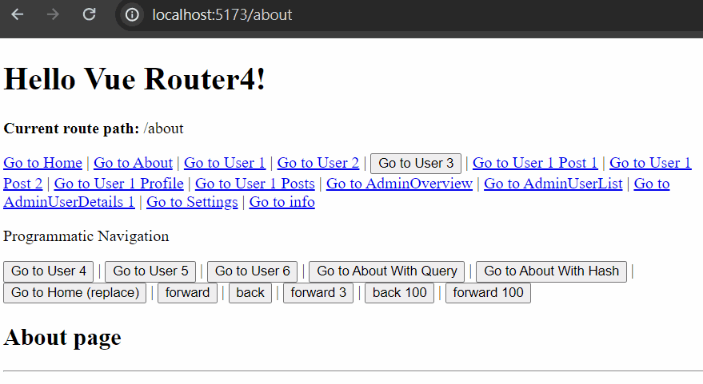

#### § 進階使用

- 在巢狀路由中設置別名時，若以 `/` 開頭，**可以使路由地址變為絕對路徑**。

- 另外也可以透過**陣列設置多個別名**。

- 若路由有動態參數，**則在絕對路經中需要確保包含動態參數**。

設置路由配置 (router/index.js)：

```javascript
//...

// 配置路由規則
const routes = [
  // ...
  // 設置多個別名
  {
    // :id 必須為數字
    path: '/photo/:id(\\d+)',
    component: () => import('@/views/PhotoLayout.vue'),
    children: [
      {
        // 將匹配 3 個 url
        // /photo/1
        // /photo/1/detail
        // /photo-1
        path: '',
        name: 'PhotoDetail',
        component: () => import('@/views/PhotoDetail.vue'),
        alias: ['detail', '/photo-:id(\\d+)'],
      },
    ],
  },
  // ...
];

//...
```

設置頁面 PhotoLayout.vue：

```vue
<template>
  <h3>PhotoLayout</h3>
  <div class="layout">
    <router-view />
  </div>
</template>

<style scoped>
.layout {
  padding: 10px;
  background-color: lightgoldenrodyellow;
}
</style>
```

設置頁面 PhotoDetail.vue：

```vue
<template>
  <h3>PhotoDetail</h3>
  <p>photoId: {{ $route.params.id }}</p>
</template>
```

設置路由切換 (App.vue)：

```vue
<template>
  <!-- 省略前面 -->

  <nav>
    <!-- 省略前面 -->
    <router-link to="/photo/2">Go to /photo/2</router-link> |
    <router-link to="/photo/6/detail">Go to /photo/6/detail</router-link> |
    <router-link to="/photo-12">Go to /photo-12</router-link>
  </nav>

  <!-- 省略 -->
</template>
```

渲染結果：

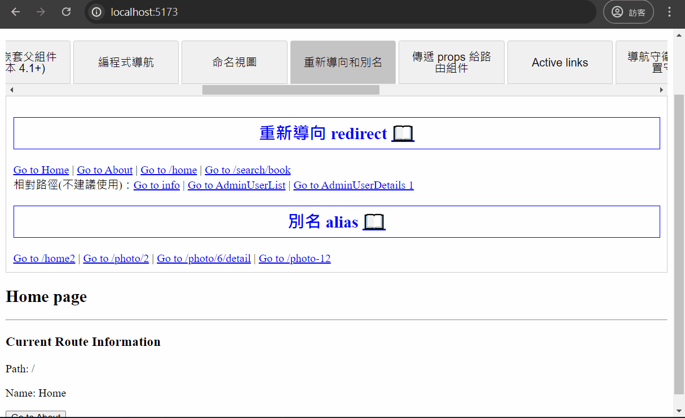

#### § 關於 SEO 的注意事項

使用別名時，建議要定義標準網址 [canonical URL](https://developers.google.com/search/docs/crawling-indexing/consolidate-duplicate-urls?visit_id=638476681905676047-2189358708&rd=1&hl=zh-tw)。

> 補充文章：[Blog1](https://welly.tw/blog/what-is-canonical-url)、[Blog2](https://www.awoo.ai/zh-hant/blog/canonical-seo/)、[github](https://github.com/vuejs/vue-router/issues/3869)、[@vueuse/head](https://github.com/vueuse/head?tab=readme-ov-file#api)。

以下範例參考上面的補充說明使用 [`@unhead/vue`](https://unhead.unjs.io/setup/vue/installation) 設置 canonical URL。

- 1.安裝 `@unhead/vue`：

  ```bash
  npm install @unhead/vue
  ```

- 2.使用 Plugin (main.js)：

  ```javascript
  import { createApp } from 'vue';
  import App from './App.vue';
  import router from './router';
  import { createHead } from '@unhead/vue';

  const app = createApp(App);

  app.use(router);

  const head = createHead();
  app.use(head);

  app.mount('#app');
  ```

- 3.App.vue 使用 `useHead` 組合式函數設置所有的 canonical URL：

  ```vue
  <script setup>
  import { useRoute, useRouter } from 'vue-router';
  import { useHead } from '@unhead/vue';

  const router = useRouter();
  const route = useRoute();

  // 設置 canonical URL
  useHead({
    link: () => [
      {
        rel: 'canonical',
        href: `${window.location.origin}${route.path}`,
      },
    ],
  });

  // 省略...
  </script>
  ```

- 4.可以在單一頁面中使用 `useHead` 設置指定的標準網址 (PhotoDetail.vue)：

  ```vue
  <script setup>
  import { useRoute } from 'vue-router';
  import { useHead } from '@unhead/vue';

  const route = useRoute();

  // 設置 canonical URL
  useHead({
    link: () => [
      {
        rel: 'canonical',
        href: `${window.location.origin}/photo/${route.params.id}`,
      },
    ],
  });
  </script>

  <template>
    <h3>PhotoDetail</h3>
    <p>photoId: {{ $route.params.id }}</p>
  </template>
  ```

渲染結果：

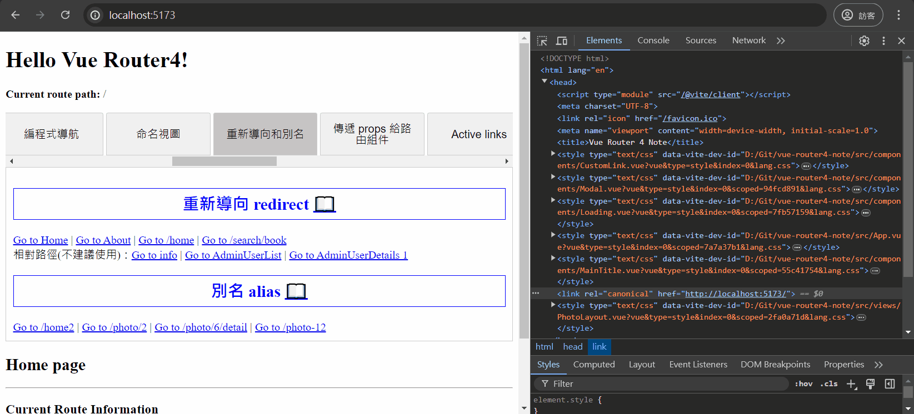

## 傳遞 props 給路由組件

在組件中使用 `$route` 和 `useRoute()` 會**造成組件與路由的高耦合**，限制組件的靈活性，因為它只能用於特定的 url。

如以下範例，`ProductDetail` 組件使用了 `$route.params.id` 來獲取 id，因此必須綁定對應的路由地址 ( `/products/:id` ) 來使用。

路由配置 (router/index.js)：

```javascript
//...

// 配置路由規則
const routes = [
  // ...
  {
    path: '/products/:id',
    name: 'ProductDetail',
    component: () => import('@/views/ProductDetail.vue'),
  },
  // ...
];

//...
```

ProductDetail.vue：

```vue
<template>
  <h3>ProductDetail</h3>
  <p>productId: {{ $route.params.id }}</p>
</template>
```

設置路由切換 (App.vue)：

```vue
<template>
  <!-- 省略前面 -->

  <nav>
    <!-- 省略前面 -->
    <router-link to="/products/1">Go to /products/1</router-link> |
    <router-link to="/products/2">Go to /products/2</router-link>
  </nav>

  <!-- 省略 -->
</template>
```

通過在路由設置 `props` 選項，則可以解除這種限制，允許你在任何地方使用、重用組件，以下分為幾種模式：

### 布林模式

當 `props` 被設置為 `true` 時，`route.params` 將被作為 `props` 傳給組件。

> 注意：此方法無法使用 `query` 帶入參數，請參考下方的[函數模式](#函數模式)。

路由配置 `props` (router/index.js)：

```javascript
//...

// 配置路由規則
const routes = [
  // ...
  // 設置 props - 布林模式
  {
    path: '/products/:id',
    name: 'ProductDetail',
    component: () => import('@/views/ProductDetail.vue'),
    props: true,
  },
  // ...
];

//...
```

修改組件接收 `props` (ProductDetail.vue)：

```vue
<script setup>
defineProps({
  id: String,
});
</script>

<template>
  <h3>ProductDetail</h3>
  <p>productId: {{ id }}</p>
</template>
```

渲染結果：

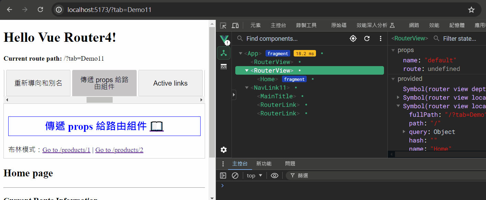

#### § 命名視圖

針對設置了命名視圖的路由，則必須為每個命名視圖定義 `props` 配置：

```javascript
//...

// 配置路由規則
const routes = [
  // ...
  // 設置 props - 布林模式
  {
    path: '/products2/:id',
    name: 'ProductWithNav',
    components: {
      default: () => import('@/views/ProductDetail.vue'),
      sidebar: () => import('@/views/ProductNav.vue'),
    },
    // 多個視圖定義 props
    props: { default: true, sidebar: false },
  },
  // ...
];

//...
```

設置路由切換 (App.vue)：

```vue
<template>
  <!-- 省略前面 -->

  <nav>
    <!-- 省略前面 -->
    <router-link to="/products2/1">Go to /products2/1</router-link> |
    <router-link to="/products2/2">Go to /products2/2</router-link>
  </nav>

  <!-- 省略 -->
</template>
```

渲染結果：

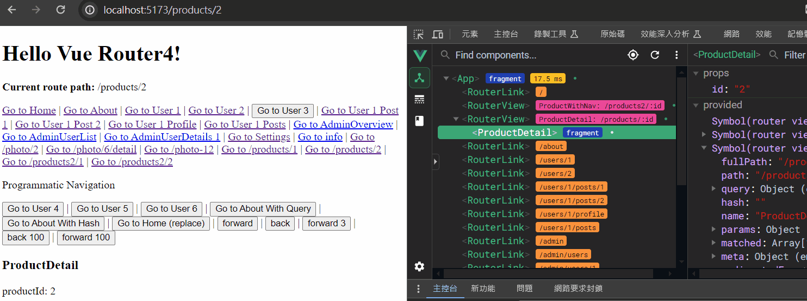

---

### 物件模式

當 `props` 設置為物件時，**它將會依照原樣作為 `props` 傳給組件**，`props` 為**靜態資料 (固定參數)** 的時候很有用。設置了命名視圖的路由一樣必須為每個命名視圖定義 `props` 配置。

路由配置 `props` (router/index.js)：

```javascript
//...

// 配置路由規則
const routes = [
  // ...
  // 設置 props - 物件模式
  {
    path: '/products',
    name: 'Products',
    component: () => import('@/views/ProductDetail.vue'),
    // 傳入靜態資料
    props: { id: '100' },
  },
  {
    path: '/products2',
    name: 'Products2',
    components: {
      default: () => import('@/views/ProductDetail.vue'),
      sidebar: () => import('@/views/ProductNav.vue'),
    },
    // 多個視圖定義 props
    props: { default: { id: '200' }, sidebar: false },
  },
  // ...
];

//...
```

設置路由切換 (App.vue)：

```vue
<template>
  <!-- 省略前面 -->

  <nav>
    <!-- 省略前面 -->
    <router-link to="/products">Go to /products</router-link> |
    <router-link to="/products2">Go to /products2</router-link>
  </nav>

  <!-- 省略 -->
</template>
```

渲染結果：

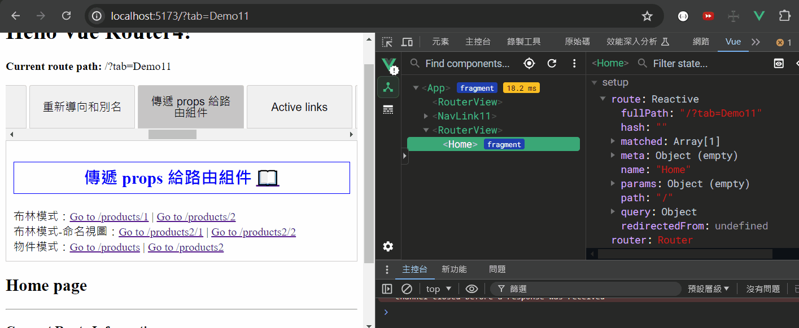

---

### 函數模式

可以創建一個返回 `props` 的函數，該函數會傳入一個 `route` 物件參數，這允許你將參數轉換為其他類型，或是將靜態值與基於路由的值相結合等等。

路由配置 `props` (router/index.js)：

```javascript
//...

// 配置路由規則
const routes = [
  // ...
  // 設置 props - 函數模式
  {
    // /find?t=vue&c=book
    // 將 { title: "vue", category: "book", isFind: true } 作為 props 傳遞給組件
    path: '/find',
    name: 'ProductFind',
    component: () => import('@/views/ProductFind.vue'),
    props: (route) => ({
      title: route.query.t,
      category: route.query.c,
      isFind: true,
    }),
  },
  // ...
];

//...
```

ProductFind.vue：

```vue
<script setup>
const props = defineProps({
  title: String,
  category: String,
  isFind: Boolean,
});
</script>

<template>
  <h3>ProductFind</h3>
  <p>props data: {{ props }}</p>
</template>
```

設置路由切換 (App.vue)：

```vue
<template>
  <!-- 省略前面 -->

  <nav>
    <!-- 省略前面 -->
    <router-link to="/find?t=vue&c=book">Go to /find?t=vue&c=book</router-link>
    |
    <router-link to="/find?t=ps5&c=game">Go to /find?t=ps5&c=game</router-link>
  </nav>

  <!-- 省略 -->
</template>
```

渲染結果：

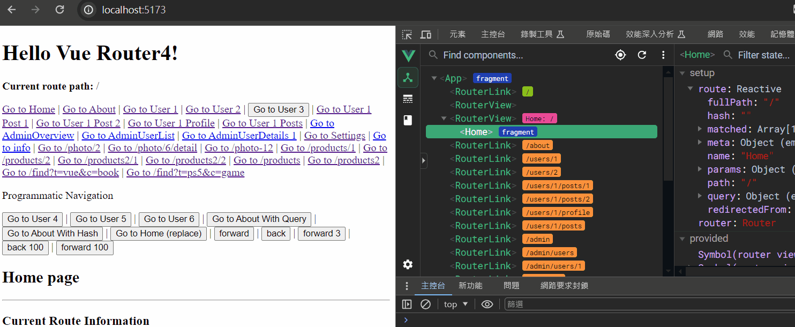

---

### 通過 `<router-view>` 插槽 (不建議)

也可以通過 `<router-view>` 插槽 (slot) 傳遞參數。

但是在這種情況下，如以下範例所示，所有的路由組件都會傳遞 `view-prop`，這表示**所有的路由組件內部都聲明了接收一個 `view-prop` 的 prop，但這未必需要，因此請盡可能使用上面其他的選項**。

```vue
<template>
  <!-- 省略前面 -->

  <router-view v-slot="{ Component }">
    <component :is="Component" view-prop="value" />
  </router-view>

  <!-- 省略 -->
</template>
```

## Active links

通常應用中會具有使用多個 `<router-link>` 組件形成的導航清單，而 `<router-link>` 提供了 `router-link-active` 以及 `router-link-exact-active` 兩個 CSS class 方便設置 active links 的樣式。

### 連結何時 active

active 狀態時會添加 `router-link-active` class。

在以下情況下，`<router-link>` 被視為處於 active 狀態：

- 它匹配與目前 url 相同的路由配置

- `params` 具有與目前 url 相同的值，不考慮其他路由屬性，例如 `query`

- 使用巢狀路由時，如果相關的 `params` 匹配，則任何指向祖先路由的連結也將被視為 active 狀態。

- 路徑不一定需要完美匹配，使用別名 ( `alias` ) 也會視為匹配，只要能對應到相同的路由配置和 `params`。

- 如果路由設置了 `redirect` 屬性，則檢查連結是否處於 active 狀態時會忽略該路由。

#### § 設置路由 active 樣式 (App.vue)：

```vue
<!-- 省略 -->
<!-- 添加連結樣式 -->
<style>
a {
  color: darkblue;
}
.router-link-active {
  color: lightcoral;
}
.router-link-exact-active {
  color: red;
}
</style>
```

渲染結果：

可以看到連結會根據 active 狀態顯示對應的樣式。

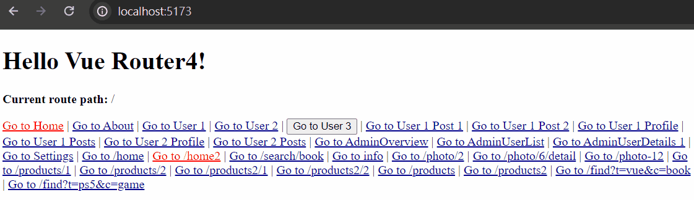

---

### 精確的 active 連結 (Exact active links)

精確匹配的連結會添加 `router-link-exact-active` class，**但是精確匹配不包括祖先路由**。

#### § 範例

路由配置 (router/index.js)：

```javascript
//...

// 配置路由規則
const routes = [
  // ...
  // 路由 active 狀態範例
  {
    path: '/students/:name',
    name: 'Students',
    component: () => import('@/views/Students.vue'),
    children: [
      {
        path: 'works/:workId',
        name: 'StudentWork',
        component: () => import('@/views/StudentWork.vue'),
      },
    ],
  },
  // ...
];

//...
```

設置頁面 Students.vue：

```vue
<template>
  <h3>Students name: {{ $route.params.name }}</h3>
  <section class="wrapper">
    <div class="sidebar">
      <h3>Work Nav</h3>
      <router-link :to="`/students/${$route.params.name}/works/1`"
        >work 1</router-link
      >
      <router-link :to="`/students/${$route.params.name}/works/2`"
        >work 2</router-link
      >
    </div>
    <div class="content">
      <router-view />
    </div>
  </section>
</template>

<style scoped>
.wrapper {
  margin-top: 10px;
  display: flex;
  min-height: 20vh;
}
.sidebar {
  margin-right: 10px;
  padding: 10px;
  border: 1px solid black;
  display: flex;
  flex-direction: column;
}
.content {
  flex: 1;
  padding: 10px;
  border: 1px solid black;
  background-color: lightseagreen;
}
</style>
```

設置頁面 StudentWork.vue：

```vue
<template>
  <h3>StudentWork</h3>
  <p>workId: {{ $route.params.workId }}</p>
</template>
```

設置路由切換 (App.vue)：

```vue
<template>
  <!-- 省略前面 -->

  <nav>
    <!-- 省略前面 -->
    <router-link to="/students/123">Go to /students/123</router-link> |
    <router-link to="/students/456">Go to /students/456</router-link>
  </nav>

  <!-- 省略 -->
</template>

<!-- 省略 -->
```

渲染結果：

以上範例中，當當前 url 路徑為 `/students/123/works/1` 時，App.vue (`/students/123`) 及 Students.vue (`/students/123/works/1`) 的兩個連結都將被視為 active 狀態，因此 `router-link-active` 會應用到兩個連結上。

但只有 Students.vue (`/students/123/works/1`) 的連結會被認為是精確的，因此 `router-link-exact-active` 只會應用到此連結。

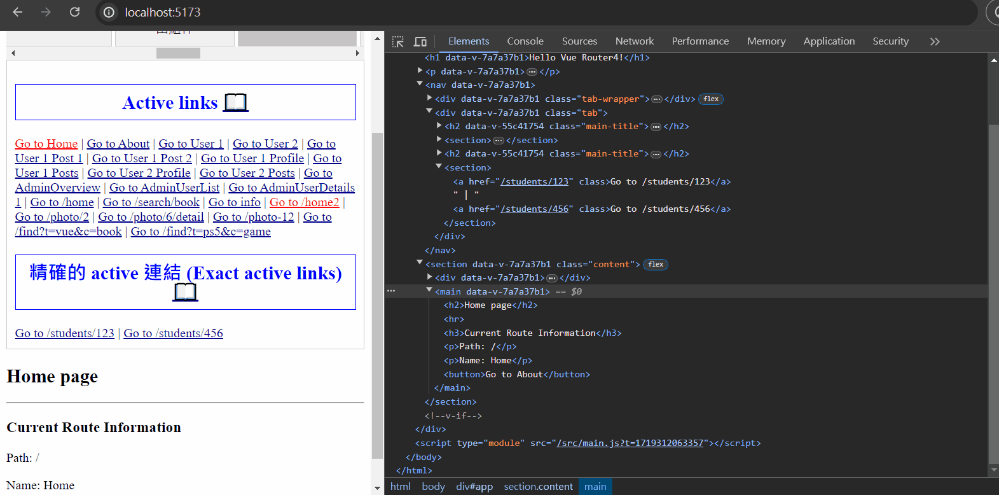

---

### 配置 active class 名稱

#### § 1.修改指定連結的 active class

`<router-link>` 組件具有 `active-class` 和 `exact-active-class` 兩個屬性，可以用來變更套用 active 狀態的 class 名稱。

Students.vue：

```vue
<template>
  <h3>Students name: {{ $route.params.name }}</h3>
  <section class="wrapper">
    <div class="sidebar">
      <h3>Work Nav</h3>
      <router-link
        :to="`/students/${$route.params.name}/works/1`"
        active-class="link-active-green"
        exact-active-class="link-exact-active-green"
        >work 1</router-link
      >
      <router-link
        :to="`/students/${$route.params.name}/works/2`"
        active-class="link-active-green"
        exact-active-class="link-exact-active-green"
        >work 2</router-link
      >
    </div>
    <div class="content">
      <router-view />
    </div>
  </section>
</template>

<!-- 省略 -->
```

App.vue：

```vue
<template>
  <!-- 省略前面 -->

  <nav>
    <!-- 省略前面 -->
    <router-link
      to="/students/123"
      active-class="link-active-green"
      exact-active-class="link-exact-active-green"
      >Go to /students/123</router-link
    >
    |
    <router-link
      to="/students/456"
      active-class="link-active-green"
      exact-active-class="link-exact-active-green"
      >Go to /students/456</router-link
    >
  </nav>

  <!-- 省略 -->
</template>

<!-- 省略 -->
<style>
/* 省略 */
/* 添加指定連結樣式 */
.link-active-green {
  color: lightseagreen;
}
.link-exact-active-green {
  color: green;
}
</style>
```

渲染結果：

現在可以看到 active 狀態套用的 class 為指定的名稱。

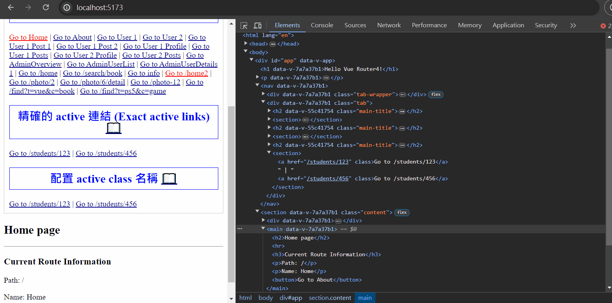

#### § 2.全域更改預設 active class

也可以透過將 `linkActiveClass` 和 `linkExactActiveClass` 選項傳遞給 `createRouter()` 來全域更改預設 active class 名稱。

全域更改 active class 名稱 (router/index.js)：

```javascript
//...

// 創建路由實例
const router = createRouter({
  // 指定模式
  history: createWebHistory(import.meta.env.BASE_URL),
  // 設定前面配置的路由
  routes,
  // 指定 active class
  linkActiveClass: 'link-active-green',
  linkExactActiveClass: 'link-exact-active-green',
});

//...
```

渲染結果：

現在全部的連結樣式都被修改。

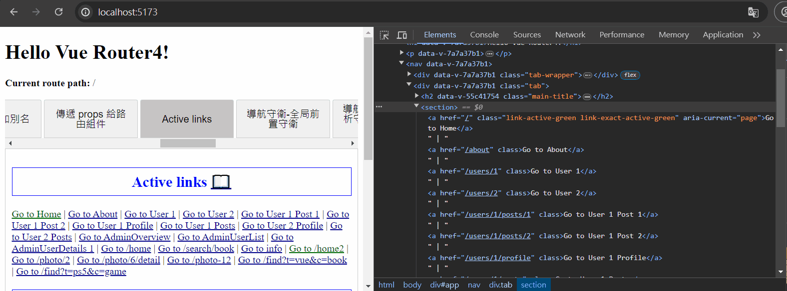

## 不同的歷史模式

在 `createRouter()` 時可以透過 `history` 選項配置選擇不同的歷史模式，Vue-Router 4 預設的是 `createWebHistory()`。

### Hash 模式

[💻Demo](https://ypinpin.github.io/vue-router-test/) | [📝Code](https://github.com/YPINPIN/vue-router-test)

`history` 設置 `createWebHashHistory()`，它在傳遞實際 url 之前使用了一個 `#` (hash) 字元，利用 `#` 做頁面的切換。這種模式因為 url 未被發送至伺服器，所以**不需要在伺服器端上進行配置處理**，但是由於添加了 `#` (hash)，**因此在 SEO 中存在一些問題**，若擔心這個問題則可以使用 HTML5 模式。

```javascript
import { createRouter, createWebHashHistory } from 'vue-router';
//...

// 創建路由實例
const router = createRouter({
  // 指定模式
  history: createWebHashHistory(),
  // 設定前面配置的路由
  routes,
});

//...
```

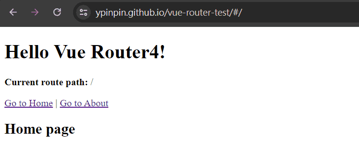

想修改預設路徑( `base` )可以參考此[官方文檔](https://router.vuejs.org/api/#createWebHashHistory)、[範例 code](https://github.com/YPINPIN/vue-router-test/commit/2a118c62d787bc118ecf192fc4a11f589a50e037)。

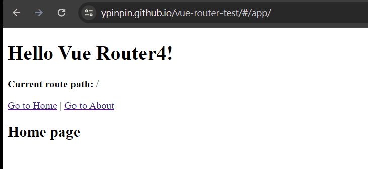

---

### HTML5 模式

`history` 設置 `createWebHistory()`，基於 History API，**這種模式實現頁面跳轉不需要重新載入頁面，且 url 看起來更加直觀不會添加特殊字元**，例如：`https://example.com/user/id`。修改路徑的方式與 Hash 模式相同，可以傳遞參數給 `createWebHistory()`，[官方文檔](https://router.vuejs.org/api/#createWebHistory)。

如果應用程序可能在不同的 url 路徑下運行（如子目錄或子網站），就建議使用 `import.meta.env.BASE_URL` 這個參數來設置應用程序的根路徑，詳細說明可以查看 [Vite 官方文檔](https://cn.vitejs.dev/guide/env-and-mode)。若無任何子目錄則可寫 `history: createWebHistory()`。

```javascript
import { createRouter, createWebHistory } from 'vue-router';
//...

// 創建路由實例
const router = createRouter({
  // 指定模式
  history: createWebHistory(import.meta.env.BASE_URL),
  // 設定前面配置的路由
  routes,
});

//...
```

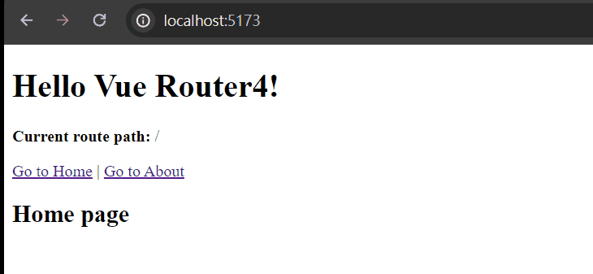

但是使用此模式時，**必須要在伺服器端進行一些配置**，不然使用者在瀏覽器中直接訪問 `https://example.com/user/id` 時，伺服器將找不到對應路徑，並會返回一個 404 錯誤。

而要解決這個問題需要在伺服器上添加配置，當 url 不匹配任何資源時，它將提供與應用中 index.html 相同的頁面。

#### § 伺服器配置

可以參考此[官方文檔](https://router.vuejs.org/guide/essentials/history-mode.html#Example-Server-Configurations)。

- 使用 Vercel 部屬的範例：

  [💻Demo](https://vue-router-test-eight.vercel.app/) | [📝Code](https://github.com/YPINPIN/vue-router-test/tree/modeHTML)

  > [vercel 相關文檔](https://vercel.com/docs/frameworks/vite#using-vite-to-make-spas)

  需要注意的是，伺服器端將不再報告 404 錯誤，因為現在所有未對應的路徑都會顯示你的 index.html 文件。因此需要在 Vue 應用中添加一個路由來匹配顯示 404 頁面。

  ```javascript
  import { createRouter, createWebHistory } from 'vue-router';
  //...

  // 配置路由規則
  const routes = [
    //...
    // 設置 404 NotFound 頁面
    {
      path: '/:pathMatch(.*)',
      name: 'NotFound',
      component: () => import('@/views/NotFound.vue'),
    },
  ];

  //...
  ```

  部屬結果：

  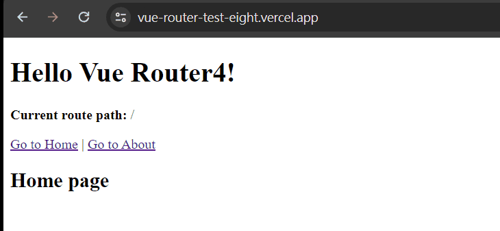

#### § GitHub Page 配置 HTML5 模式出現 404 錯誤

因為 github 無法幫開發者進行路由對應，因此建議改用 Hash 模式或是使用其他託管平台，例如：Netlify、Vercel。

更多說明可以參考此 [github discussions](https://github.com/orgs/community/discussions/36908)、[stackoverflow](https://stackoverflow.com/questions/48521177/404-when-reloading-a-vue-website-published-to-github-pages)。

---

### Memory 模式

`history` 設置 `createMemoryHistory()`，不會修改 url，路由地址只存在記憶體中，**因此沒有歷史紀錄，無法使用上一頁/下一頁，刷新頁面則會回到首頁**。較適合 Node 環境以及 SSR。

```javascript
import { createRouter, createMemoryHistory } from 'vue-router';
//...

// 創建路由實例
const router = createRouter({
  // 指定模式
  history: createMemoryHistory(),
  // 設定前面配置的路由
  routes,
});

//...
```

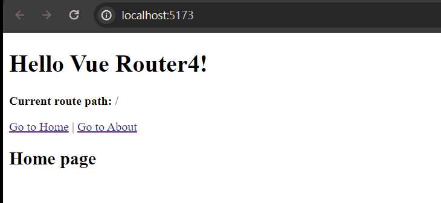

## 導航守衛

導航守衛主要是透過重新導向或是取消的方式來守衛導航，有針對全局的、單一路由的以及組件的各種方式。

### 全局前置守衛

可以使用 `router.beforeEach` 來註冊一個全局前置守衛，當一個導航觸發時，全局前置守衛會按照創建順序調用。

每個守衛方法主要接收兩個參數：

- `to` -> 即將要進入的目標路由物件

- `from` -> 當前正要離開的路由物件

```javascript
import { createRouter, createWebHistory } from 'vue-router';
//...

// 創建路由實例
const router = createRouter({
  //...
});

// 全局前置守衛
router.beforeEach((to, from) => {
  console.log('to:', to);
  console.log('from:', from);
});

//...
```

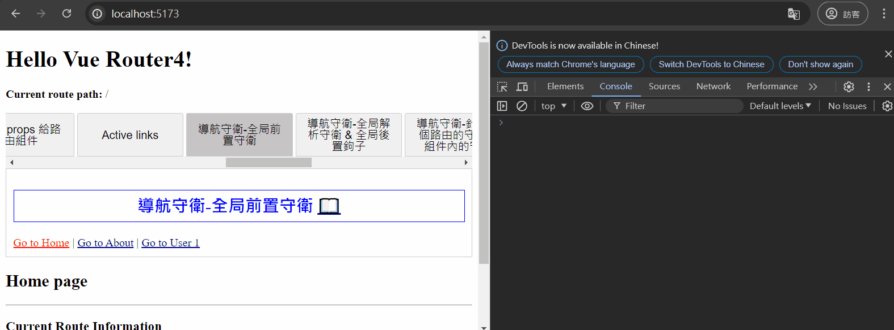

> 補充：可選的第三個參數 `next`，以後可能被移除，不建議使用。在之前的 Vue Router 版本中，必須使用第三個參數 `next`，因開發中很容易調用多次 `next`，目前已將其取消，但是仍然支持使用。但是使用時，請確保 `next` 在各邏輯中只被調用一次，否則鉤子將永遠不會被 `resolve` 或報錯。詳細說明可以查看此[官方文檔](https://router.vuejs.org/zh/guide/advanced/navigation-guards.html#%E5%8F%AF%E9%80%89%E7%9A%84%E7%AC%AC%E4%B8%89%E4%B8%AA%E5%8F%82%E6%95%B0-next)。

可以返回的值有以下三種：

- `false`

  會取消當前的導航。

  ```javascript
  import { createRouter, createWebHistory } from 'vue-router';
  //...

  // 創建路由實例
  const router = createRouter({
    //...
  });

  router.beforeEach((to, from) => {
    //...
    // 透過返回 false 取消導航
    return false;
  });

  //...
  ```

  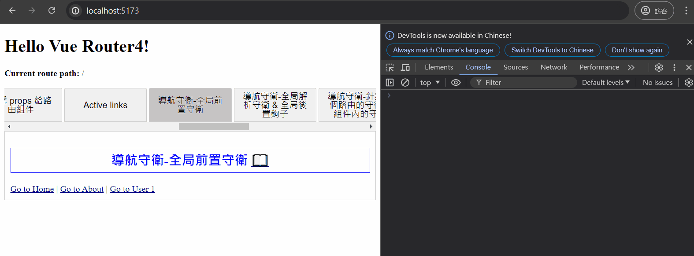

- 一個路由地址(字串或物件)

  **通過路由地址重新導向到一個不同的地址，如同調用 `router.push()`**。會中斷當前的導航，同時用相同的 from 創建一個新的導航。

- 不返回或返回 `undefined`、`true`

  則導航是有效的，並且調用下一個導航守衛。

  ```javascript
  import { createRouter, createWebHistory } from 'vue-router';
  //...

  // 配置路由規則
  const routes = [
    //...
    // Login 頁面
    {
      path: '/login',
      name: 'Login',
      component: () => import('@/views/Login.vue'),
    },
    //...
  ];

  // 創建路由實例
  const router = createRouter({
    //...
  });

  // 全局前置守衛
  router.beforeEach((to, from) => {
    //...
    // 一個路由地址(字串或物件)
    if (!isAuthenticated() && to.name !== 'Login') {
      // 重新導向到登入頁
      return { name: 'Login' };
    } else {
      // 不返回或返回 undefined、true
      // return undefined;
      // return true;
    }
  });

  // 檢查使用者是否已經登入
  function isAuthenticated() {
    const isLogin = localStorage.getItem('isLogin');
    return isLogin;
  }

  //...
  ```

  登入頁設置 Login.vue：

  ```vue
  <script setup>
  import { useRouter } from 'vue-router';
  import { ref } from 'vue';

  const router = useRouter();

  const isLogin = ref(localStorage.getItem('isLogin'));

  function login() {
    localStorage.setItem('isLogin', true);
    router.push({ name: 'Home' });
  }
  function logout() {
    localStorage.removeItem('isLogin');
    isLogin.value = null;
  }
  </script>

  <template>
    <h2>Login page</h2>
    <hr />
    <button v-if="isLogin" @click="logout">Logout</button>
    <button v-else @click="login">Login</button>
  </template>
  ```

  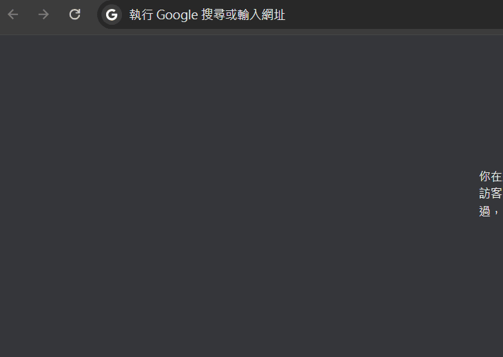

如果遇到意外情況，可能會拋出一個 Error，**這會取消導航並且調用 `router.onError()` 註冊過的回調**。

---

### 全局解析守衛

可以使用 `router.beforeResolve` 來註冊一個全局解析守衛，和 `router.beforeEach` 類似，它在每次導航時都會觸發，**全局解析守衛會在導航被確認之前、所有組件內守衛和異步路由組件被解析之後調用，是獲取數據或執行任何其他操作 (如果使用者無法進入頁面時希望避免執行的操作) 的理想位置**。

以下範例為確保使用者可以訪問自定義的 `meta` 屬性並進行操作。

```javascript
import { createRouter, createWebHistory } from 'vue-router';
//...

// 配置路由規則
const routes = [
  //...
  // Camera 頁面
  {
    path: '/camera',
    name: 'Camera',
    component: () => import('@/views/Camera.vue'),
    meta: { requiresCamera: true },
  },
  //...
];

// 創建路由實例
const router = createRouter({
  //...
});

//...

// 全局解析守衛
router.beforeResolve(async (to) => {
  console.log('router beforeResolve--');
  if (to.meta.requiresCamera) {
    try {
      await askForCameraPermission();
    } catch (error) {
      console.log(error);
      if (error === 'NotAllowedError') {
        // 處理錯誤並取消導航
        return false;
      } else {
        // 意料之外的錯誤，取消導航並把錯誤傳給全局處理器
        throw error;
      }
    }
  }
});

// 模擬獲取權限
function askForCameraPermission() {
  console.log('askForCameraPermission...');
  return new Promise((resolve, reject) => {
    setTimeout(() => {
      if (Math.random() > 0.5) {
        resolve();
      } else {
        reject('NotAllowedError');
      }
    }, 2000);
  });
}

//...
```

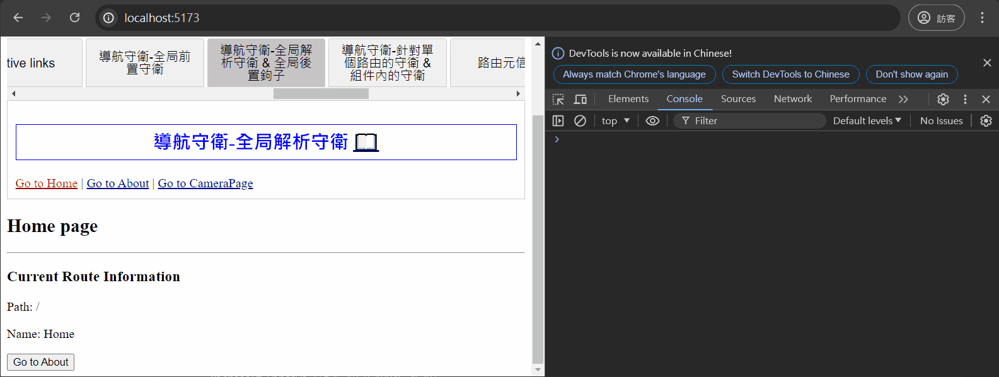

---

### 全局後置鉤子

可以使用 `router.afterEach` 來註冊一個全局後置鉤子，**和守衛不同的是，這些鉤子不會接受 `next` 函數，也不會改變導航本身**，對於分析等等輔助功能很有用。

另外接收 `navigation failures` 作為第三個參數，表示路由跳轉失敗。

```javascript
import { createRouter, createWebHistory } from 'vue-router';
//...

// 創建路由實例
const router = createRouter({
  //...
});

//...

// 全局後置鉤子
router.afterEach((to, from, failure) => {
  console.log('router afterEach--');
  if (failure) {
    sendToAnalytics(to, from, failure);
  }
});

function sendToAnalytics(to, from, failure) {
  console.log('sendToAnalytics---', failure);
}

//...
```

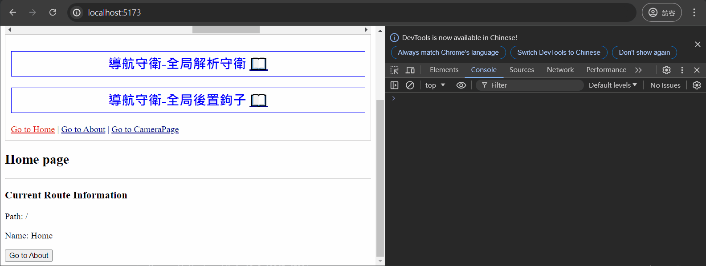

---

### 針對單個路由的守衛

可以直接在單一路由上配置 `beforeEnter` 守衛，需要注意的是`beforeEnter` 只在進入路由時觸發，不會在 `params`、`query` 或 `hash` 改變時觸發，**只有在從一個不同的路由導航時才會觸發**。

```javascript
import { createRouter, createWebHistory } from 'vue-router';
//...

// 配置路由規則
const routes = [
  //...
  // Test 頁面
  {
    path: '/test/:testId',
    name: 'Test',
    component: () => import('@/views/Test.vue'),
    beforeEnter: (to, from) => {
      console.log('beforeEnter-- /test/:testId ');
      // 可以根據條件決定是否取消導航
      // return false;
    },
  },
  //...
];

// 創建路由實例
const router = createRouter({
  //...
});

//...
```

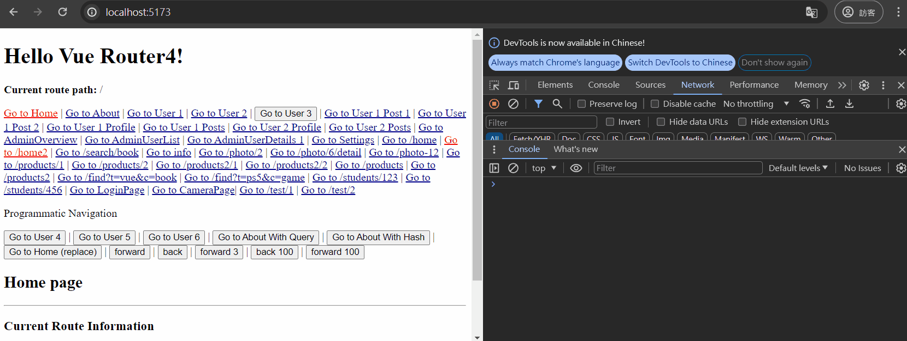

也可以傳遞一個函數陣列給 `beforeEnter`，**這對在不同的路由中重用相同的守衛時很有幫助**。

> 也可以通過自定義的 `meta` 屬性搭配前面的全局導航守衛來實現類似的行為。

```javascript
import { createRouter, createWebHistory } from 'vue-router';
//...

// 配置路由規則
const routes = [
  //...
  // Test 頁面
  {
    path: '/test/:testId',
    name: 'Test',
    component: () => import('@/views/Test.vue'),
    // 設置函數陣列
    beforeEnter: [removeQuery, removeHash],
  },
  //...
];

// 創建路由實例
const router = createRouter({
  //...
});

// 共用函數
function removeQuery(to) {
  if (Object.keys(to.query).length) {
    console.log('removeQuery');
    return { path: to.path, query: {}, hash: to.hash };
  }
}
function removeHash(to) {
  if (to.hash) {
    console.log('removeHash');
    return { path: to.path, query: to.query, hash: '' };
  }
}

//...
```


---

### 組件內的守衛

#### § 使用 Options API

可以在路由組件內直接定義的路由守衛有以下三種。

- `beforeRouteEnter`

  **在組件的對應路由確認前調用，組件尚未創建**，因此不可以訪問 `this`，但是可以通過傳遞回調函數給 `next` 參數，`next` 會在導航被確認的時候執行回調函數，並把組件實例作為參數傳入。

  > 注意只有 `beforeRouteEnter` 支持給 `next` 傳遞回調函數。

  Test.vue：

  ```vue
  <script>
  export default {
    name: 'Test',
    data() {
      return {
        title: 'test page',
      };
    },
    beforeRouteEnter(to, from, next) {
      console.log('beforeRouteEnter--');
      next((vm) => {
        // 通過 vm 訪問組件實例
        console.log('title:', vm.title);
      });
    },
  };
  </script>

  <template>
    <h2>Test page</h2>
    <p>testId: {{ $route.params.testId }}</p>
  </template>
  ```

  渲染結果：

  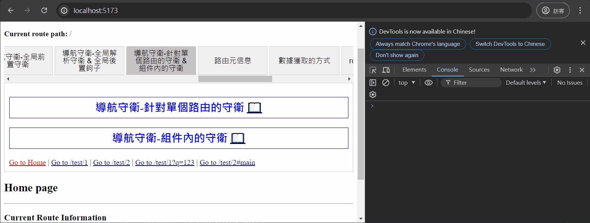

- `beforeRouteUpdate`

  **當前路由改變但是組件被複用時調用**，例如帶有動態參數的路由 `/test/:testId`，在 /test/1 和 /test/2 之間跳轉的時候被調用。因為組件已經掛載好，所以可以訪問 `this` (組件實例)。

  Test.vue：

  ```vue
  <script>
  export default {
    name: 'Test',
    data() {
      return {
        title: 'test page',
      };
    },
    //...
    beforeRouteUpdate(to, from) {
      // 可以使用 this
      console.log(
        `beforeRouteUpdate-- title: ${this.title} id: ${to.params.testId}`
      );
    },
  };
  </script>

  <template>
    <h2>Test page</h2>
    <p>testId: {{ $route.params.testId }}</p>
  </template>
  ```

  渲染結果：

  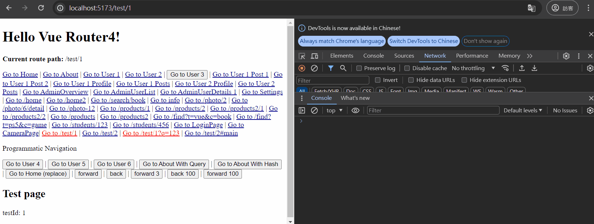

- `beforeRouteLeave`

  導航離開組件對應路由時調用，通常用來預防使用者在未保存修改前突然離開，可以通過返回 `false` 來取消導航。

  Test.vue：

  ```vue
  <script>
  export default {
    name: 'Test',
    data() {
      return {
        title: 'test page',
      };
    },
    //...
    beforeRouteLeave(to, from) {
      console.log('beforeRouteLeave--');
      const answer = window.confirm(
        'Do you really want to leave? you have unsaved changes!'
      );
      if (!answer) {
        return false;
      }
    },
  };
  </script>

  <template>
    <h2>Test page</h2>
    <p>testId: {{ $route.params.testId }}</p>
  </template>
  ```

  渲染結果：

  

#### § 使用 組合式 API

組合式 API 可以使用 `onBeforeRouteUpdate` 以及 `onBeforeRouteLeave` 分別添加 update 和 leave 守衛，並且可以用在任何由 `<router-view>` 渲染的組件中，不限於路由組件。

需要注意由於 `setup` 被調用的時機 (導航已經被確認)，因此組合式 API 不存在 `onBeforeRouteEnter`。

Test.vue：

```vue
<script setup>
import { onBeforeRouteUpdate, onBeforeRouteLeave } from 'vue-router';

onBeforeRouteUpdate((to, from) => {
  console.log('onBeforeRouteUpdate-- id:', to.params.testId);
});
onBeforeRouteLeave((to, from) => {
  console.log('onBeforeRouteLeave--');
  const answer = window.confirm(
    'Do you really want to leave? you have unsaved changes!'
  );
  //取消導航並停留在當前頁面
  if (!answer) {
    return false;
  }
});
</script>

<template>
  <h2>Test page</h2>
  <p>testId: {{ $route.params.testId }}</p>
</template>
```

渲染結果：

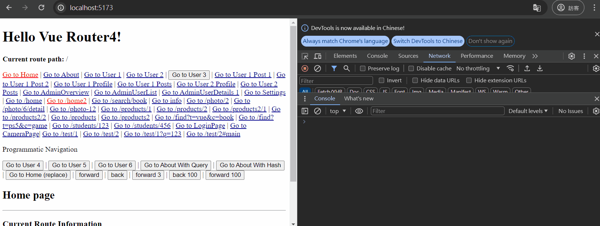

---

### 完整的導航流程

- 1.導航被觸發
- 2.準備離開的組件裡調用 `beforeRouteLeave` ( `onBeforeRouteLeave` )
- 3.調用全局守衛 `beforeEach`
- 4.在重用的組件裡調用 `beforeRouteUpdate` ( `onBeforeRouteUpdate` )
- 5.在路由配置裡調用 `beforeEnter`
- 6.解析異步路由組件
- 7.在被啟動的組件裡調用 `beforeRouteEnter`
- 8.調用全局守衛 `beforeResolve`
- 9.導航被確認
- 10.調用全局的 `afterEach` 鉤子
- 11.觸發 DOM 更新
- 12.調用 `beforeRouteEnter` 中傳給 `next` 的回調函數，創建好的組件實例會作為回調函數的參數傳入

## 路由元信息

可以通過在路由配置 `meta` 屬性來將任意信息附加到路由上，例如：誰可以訪問路由、transition 名稱等等，**它可以在路由地址和導航守衛上被訪問到**。

### 配置 meta

```javascript
import { createRouter, createWebHistory } from 'vue-router';
//...

// 配置路由規則
const routes = [
  //...
  // 路由元信息
  {
    path: '/comments',
    component: () => import('@/views/CommentsLayout.vue'),
    children: [
      {
        path: 'new',
        name: 'CommentNew',
        component: () => import('@/views/CommentNew.vue'),
        // 只有經過身分驗證的使用者可以留言
        meta: { requiresAuth: true },
      },
      {
        path: ':id',
        name: 'CommentDetail',
        component: () => import('@/views/CommentDetail.vue'),
        // 任何人都可以查看留言
        meta: { requiresAuth: false },
      },
    ],
  },
  //...
];

//...
```

設置 CommentsLayout.vue：

```vue
<script setup>
import { ref } from 'vue';

const hasAuth = ref(localStorage.getItem('hasAuth'));

function setAuth() {
  localStorage.setItem('hasAuth', true);
  hasAuth.value = 'true';
}
function removeAuth() {
  localStorage.removeItem('hasAuth');
  hasAuth.value = null;
}
</script>

<template>
  <h3>CommentsLayout</h3>
  <button v-if="hasAuth" @click="removeAuth">removeAuth</button>
  <button v-else @click="setAuth">setAuth</button>
  <hr />
  <router-link to="/comments/new">new comment</router-link> |
  <router-link to="/comments/1">Go to comment id 1</router-link> |
  <router-link to="/comments/2">Go to comment id 2</router-link>
  <div class="layout">
    <router-view />
  </div>
</template>

<style scoped>
.layout {
  padding: 10px;
  background-color: lightsalmon;
  min-height: 20vh;
}
</style>
```

### 獲取 meta

透過 `route.meta` 可以直接訪問設置的元信息，可以搭配導航守衛進行指定的操作。

```javascript
import { createRouter, createWebHistory } from 'vue-router';
//...

// 創建路由實例
const router = createRouter({
  //...
});

// 全局前置守衛
router.beforeEach((to, from) => {
  //...
  // 檢查路由是否需要授權
  if (to.meta.requiresAuth && !hasAuth()) {
    window.alert('You need to set Auth.');
    // 取消導航
    return false;
  }
});

//...

// 檢查使用者是否取得權限
function hasAuth() {
  const hasAuth = localStorage.getItem('hasAuth');
  return hasAuth;
}

//...
```

渲染結果：

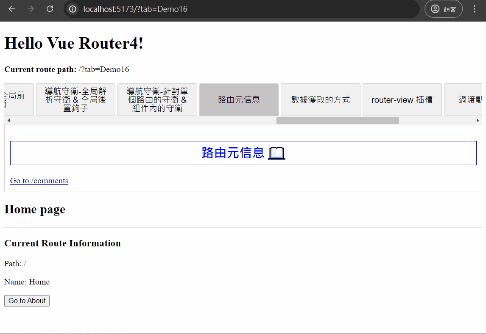

## 數據獲取的方式

有時進入一個路由之後，需要從伺服器獲取數據，可以通過以下兩種方式來實現。

### 1.導航完成之後獲取數據

這種方式會馬上導航並渲染組件，並在組件中實現獲取數據。可以在獲取數據期間添加 loading 狀態顯示。

```javascript
import { createRouter, createWebHistory } from 'vue-router';
//...

// 配置路由規則
const routes = [
  //...
  // 數據獲取 - ShowPost 頁面
  {
    path: '/showpost/:postId',
    name: 'ShowPost',
    component: () => import('@/views/ShowPost.vue'),
  },
  //...
];

//...
```

設置 ShowPost 頁面：

```vue
<script setup>
import { ref, watch } from 'vue';
import { useRoute } from 'vue-router';

const route = useRoute();
const loading = ref(false);
const post = ref(null);
const error = ref(null);

watch(() => route.params.postId, fetchData, { immediate: true });

async function fetchData(postId) {
  error.value = null;
  post.value = null;
  loading.value = true;

  try {
    const res = await fetch(
      `https://jsonplaceholder.typicode.com/posts/${postId}`
    );
    if (res.ok) {
      // Promise resolved and HTTP status is successful
      post.value = await res.json();
    } else {
      // Custom message for failed HTTP codes
      if (res.status === 404) throw new Error('404, Not found');
      // For any other server error
      throw new Error(res.status);
    }
  } catch (err) {
    error.value = err.toString();
  } finally {
    loading.value = false;
  }
}
</script>

<template>
  <h2>ShowPost page</h2>
  <hr />
  <div v-if="loading" class="loading">Loading...</div>
  <div v-if="error" class="error">{{ error }}</div>
  <div v-if="post" class="content">
    <h3>title: {{ post.title }}</h3>
    <p>possId: {{ post.id }}</p>
    <p>content: {{ post.body }}</p>
  </div>
</template>
```

渲染結果：

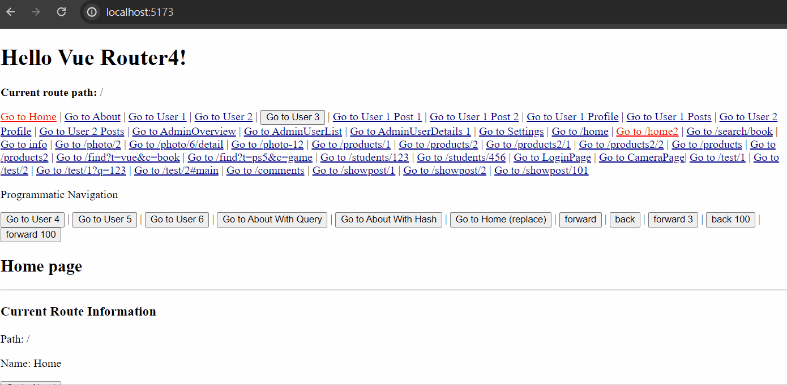

### 2.導航完成之前先獲取數據

這種方式是**在導航轉入新的路由之前獲取數據**。

可以在組件中的導航守衛 `beforeRouteEnter` 中獲取數據，獲得數據之後再傳遞數據給 `next` 的回調函數處理，可以用來將數據傳遞給組件實例。

**在獲取數據完成之前使用者會停留在原本的頁面**，因此建議顯示一些進度條或其他提示信息，如果獲取失敗，也需要展示一些錯誤提示。

> 需要注意的是 `beforeRouteEnter` 只會在第一次進入路由時調用，可以搭配 `beforeRouteUpdate` 使用。

```javascript
import { createRouter, createWebHistory } from 'vue-router';
//...

// 配置路由規則
const routes = [
  //...
  // 數據獲取 - ShowPost2 頁面
  {
    path: '/showpost2/:postId',
    name: 'ShowPost2',
    component: () => import('@/views/ShowPost2.vue'),
  },
  //...
];

//...
```

設置 ShowPost2 頁面：

```vue
<script>
import { getPost } from '@/utility/api.js';
// 全局控制 loading 狀態
import { loading } from '@/utility/loading.js';

export default {
  async beforeRouteEnter(to, from, next) {
    // 顯示 loading
    loading.set(true);
    const data = await getPost(to.params.postId);
    next((vm) => {
      // 通過 vm 訪問組件實例方法傳遞數據
      vm.setData(data);
    });
  },
  async beforeRouteUpdate(to, from) {
    loading.set(true);
    const data = await getPost(to.params.postId);
    this.setData(data);
  },
};
</script>

<script setup>
import { ref } from 'vue';

const post = ref(null);
const error = ref(null);

function setData(data) {
  post.value = data.post;
  error.value = data.error;
  // 關閉 loading
  loading.set(false);
}

// 暴露方法
defineExpose({
  setData,
});
</script>

<template>
  <h2>ShowPost2 page</h2>
  <hr />
  <div v-if="error" class="error">{{ error }}</div>
  <div v-if="post" class="content">
    <h3>title: {{ post.title }}</h3>
    <p>possId: {{ post.id }}</p>
    <p>content: {{ post.body }}</p>
  </div>
</template>
```

渲染結果：

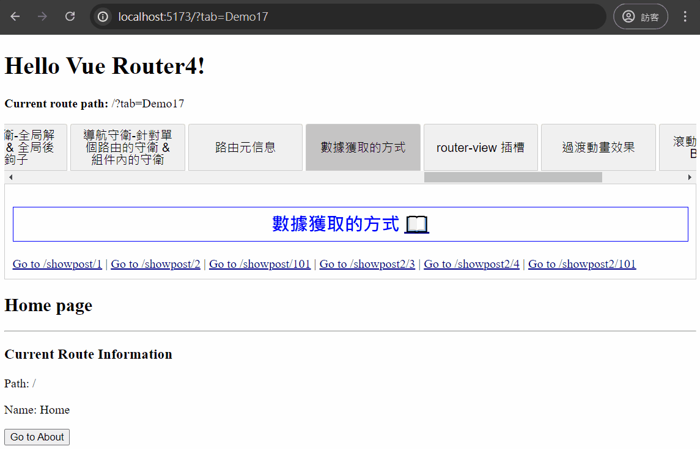

## router-view 插槽

`<router-view>` 組件暴露了一個插槽，可以用來渲染路由組件。

以下程式碼等同於不帶插槽的 `<router-view />`，但是插槽可以提供額外的擴展性。

SlotLayout.vue：

```vue
<template>
  <h2>SlotLayout Page</h2>
  <hr />
  <router-link to="/slot/one">Go to /slot/one</router-link> |
  <router-link to="/slot/two">Go to /slot/two</router-link>

  <router-view v-slot="{ Component }">
    <component :is="Component" />
  </router-view>
</template>
```

路由配置 (router/index.js)：

```javascript
import { createRouter, createWebHistory } from 'vue-router';
//...

// 配置路由規則
const routes = [
  //...
  // router-view 插槽
  {
    path: '/slot',
    component: () => import('@/views/SlotLayout.vue'),
    children: [
      {
        path: 'one',
        name: 'SlotComp1',
        component: () => import('@/views/SlotComp1.vue'),
      },
      {
        path: 'two',
        name: 'SlotComp2',
        component: () => import('@/views/SlotComp2.vue'),
      },
    ],
  },
  //...
];

//...
```

渲染結果：

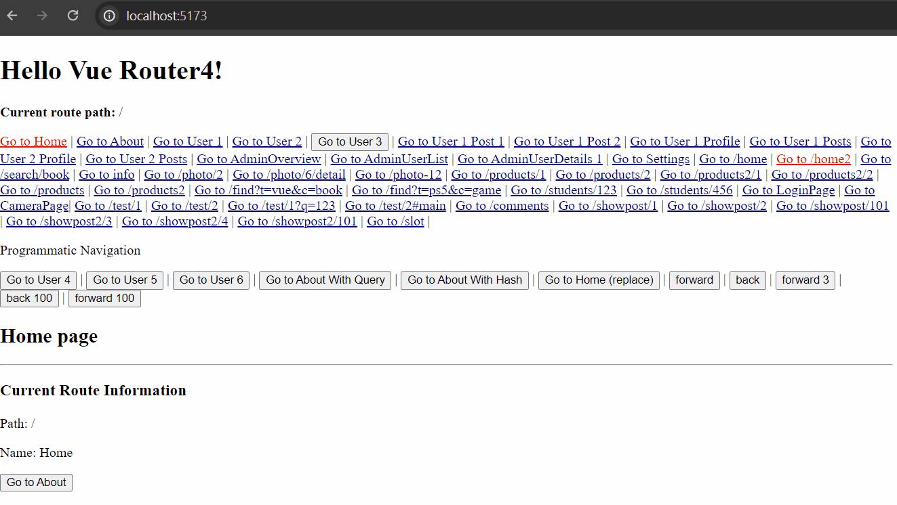

---

### KeepAlive & Transition

當在使用 `<keep-alive>` 組件時，通常想要緩存的是路由組件，而不是 `<router-view>` 本身，因此可以將 `<keep-alive>` 組件放置在插槽內。

SlotLayout.vue：

```vue
<template>
  <h2>SlotLayout Page</h2>
  <hr />
  <router-link to="/slot/one">Go to /slot/one</router-link> |
  <router-link to="/slot/two">Go to /slot/two</router-link>

  <router-view v-slot="{ Component }">
    <keep-alive>
      <component :is="Component" />
    </keep-alive>
  </router-view>
</template>
```

渲染結果：


使用 `<transition>` 組件來設置路由組件的切換過渡效果時，也是一樣的用法，並且也可以搭配 `<keep-alive>` 使用。

SlotLayout.vue：

```vue
<template>
  <h2>SlotLayout Page</h2>
  <hr />
  <router-link to="/slot/one">Go to /slot/one</router-link> |
  <router-link to="/slot/two">Go to /slot/two</router-link>

  <router-view v-slot="{ Component }">
    <transition mode="out-in">
      <keep-alive>
        <component :is="Component" />
      </keep-alive>
    </transition>
  </router-view>
</template>

<style scoped>
.v-enter-from,
.v-leave-to {
  opacity: 0;
}
.v-enter-active,
.v-leave-active {
  transition: opacity 0.5s ease;
}
</style>
```

渲染結果：

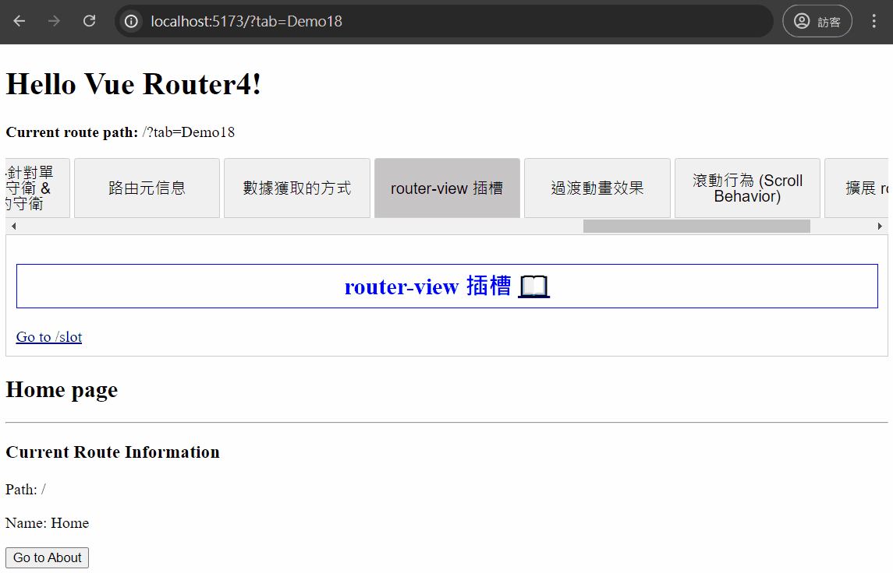

---

### 模板引用

使用插槽可以讓我們**直接將模板引用放置在路由組件上**。

SlotLayout.vue：

```vue
<script setup>
import { ref } from 'vue';
const comp = ref(null);

function showCount() {
  console.log('current count: ', comp.value.count);
}
</script>

<template>
  <h2>SlotLayout Page</h2>
  <hr />
  <router-link to="/slot/one">Go to /slot/one</router-link> |
  <router-link to="/slot/two">Go to /slot/two</router-link> |
  <button @click="showCount">showCount</button>

  <router-view v-slot="{ Component }">
    <transition mode="out-in">
      <keep-alive>
        <component :is="Component" ref="comp" />
      </keep-alive>
    </transition>
  </router-view>
</template>

<!-- 省略 -->
```

渲染結果：

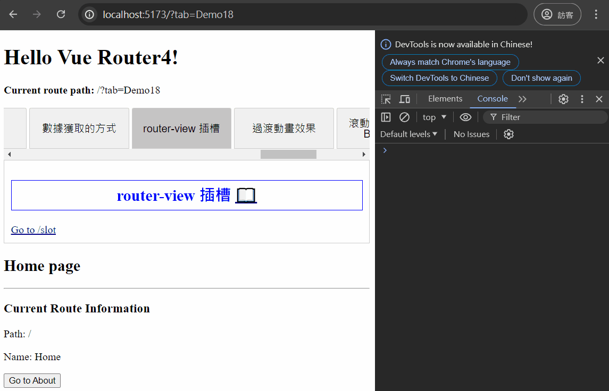

## 過渡動畫效果

想要在路由組件上使用轉場效果，並對導航進行動畫處理，需要使用 [router-view 插槽](#router-view-插槽)。

```vue
<template>
  <!-- 省略 -->
  <router-view v-slot="{ Component }">
    <transition name="fade" mode="out-in">
      <component :is="Component" />
    </transition>
  </router-view>
</template>

<!-- 省略 -->
```

### 單個路由的過渡

上面的用法會對**所有的路由使用相同的過渡效果**。

可以使用 `meta` ([路由元信息](#路由元信息)) 搭配動態的 `name` 讓每個路由的組件有不同的過渡效果。

路由配置 (router/index.js)：

```javascript
import { createRouter, createWebHistory } from 'vue-router';
//...

// 配置路由規則
const routes = [
  //...
  // 單一路由指定 transition
  {
    path: '/transition',
    component: () => import('@/views/PanelLayout.vue'),
    children: [
      {
        path: '',
        redirect: '/transition/left',
      },
      {
        path: 'left',
        component: () => import('@/views/PanelLeft.vue'),
        meta: { transition: 'slide-left' },
      },
      {
        path: 'right',
        component: () => import('@/views/PanelRight.vue'),
        meta: { transition: 'slide-right' },
      },
      {
        path: 'other',
        component: () => import('@/views/PanelOther.vue'),
      },
    ],
  },
  //...
];

//...
```

PanelLayout.vue：

```vue
<template>
  <h2>PanelLayout Page</h2>
  <hr />
  <router-link to="/transition/left">Go to /transition/left</router-link> |
  <router-link to="/transition/right">Go to /transition/right</router-link> |
  <router-link to="/transition/other">Go to /transition/other</router-link>

  <router-view v-slot="{ Component, route }">
    <transition
      :name="route.meta.transition?.toString() || 'fade'"
      mode="out-in"
      appear
    >
      <component :is="Component" />
    </transition>
  </router-view>
</template>

<style scoped>
/* fade */
.fade-enter-from,
.fade-leave-to {
  opacity: 0;
}
.fade-enter-active,
.fade-leave-active {
  transition: opacity 0.5s ease;
}

/* slide-left */
.slide-left-enter-from {
  opacity: 0;
  transform: translateX(-100%);
}
.slide-left-leave-to {
  opacity: 0;
}
.slide-left-enter-active,
.slide-left-leave-active {
  transition: opacity 0.5s ease, transform 0.5s ease;
}

/* slide-right */
.slide-right-enter-from {
  opacity: 0;
  transform: translateX(100%);
}
.slide-right-leave-to {
  opacity: 0;
}
.slide-right-enter-active,
.slide-right-leave-active {
  transition: opacity 0.5s ease, transform 0.5s ease;
}
</style>
```

渲染結果：

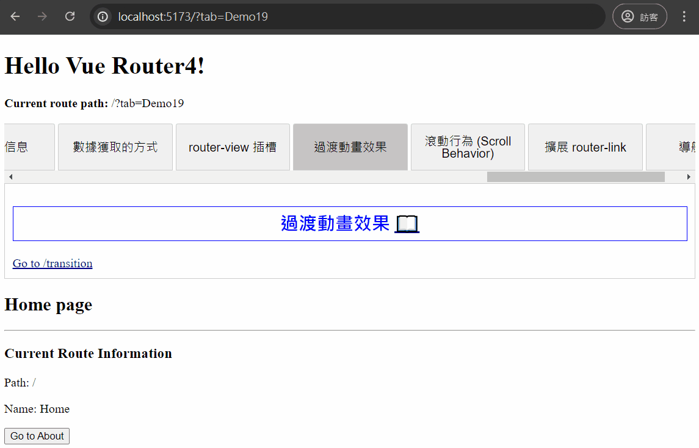

---

### 基於路由的動態過渡

也可以添加一個[全局後置鉤子](#全局後置鉤子)，根據目標路由和當前路由之間的關係，根據路徑的深度動態添加信息到 `meta` 來決定使用的過渡效果。

路由配置 (router/index.js)：

```javascript
import { createRouter, createWebHistory } from 'vue-router';
//...

// 配置路由規則
const routes = [
  //...
  // 基於路由的動態過渡
  {
    path: '/transition-step',
    component: () => import('@/views/StepLayout.vue'),
    children: [
      {
        path: '',
        redirect: '/transition-step/step1',
      },
      {
        path: 'step1',
        component: () => import('@/views/Step1.vue'),
      },
      {
        path: 'step1/1',
        component: () => import('@/views/Step1_1.vue'),
      },
      {
        path: 'step1/2',
        component: () => import('@/views/Step1_2.vue'),
      },
    ],
  },
  //...
];

// 創建路由實例
const router = createRouter({
  //...
});

//...

// 全局後置鉤子
router.afterEach((to, from, failure) => {
  //...
  // 基於路由設置動態過渡效果
  let toPath = to.path.split('/');
  if (toPath[1] && toPath[1] === 'transition-step') {
    const toDepth = toPath.length;
    const fromDepth = from.path.split('/').length;
    to.meta.transition = toDepth < fromDepth ? 'slide-right' : 'slide-left';
  }
});
```

StepLayout.vue：

```vue
<template>
  <h2>StepLayout Page</h2>
  <hr />

  <router-view v-slot="{ Component, route }">
    <transition :name="route.meta.transition?.toString()" mode="out-in" appear>
      <component :is="Component" />
    </transition>
  </router-view>
</template>

<style scoped>
/* slide-left */
.slide-left-enter-from {
  opacity: 0;
  transform: translateX(-100%);
}
.slide-left-leave-to {
  opacity: 0;
}
.slide-left-enter-active,
.slide-left-leave-active {
  transition: opacity 0.5s ease, transform 0.5s ease;
}

/* slide-right */
.slide-right-enter-from {
  opacity: 0;
  transform: translateX(100%);
}
.slide-right-leave-to {
  opacity: 0;
}
.slide-right-enter-active,
.slide-right-leave-active {
  transition: opacity 0.5s ease, transform 0.5s ease;
}
</style>
```

渲染結果：

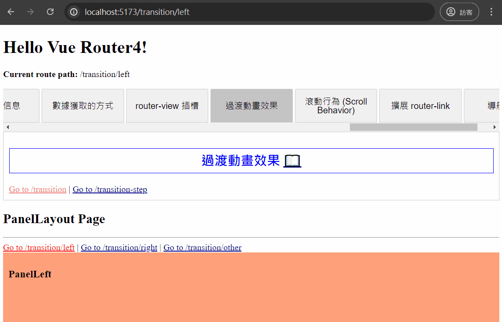

---

### 強制在複用的路由組件之間進行過渡

Vue 可能會自動複用看起來相似的組件，從而忽略了過渡。可以透過添加一個 `key` 屬性來強制過渡，這也允許你在相同路由上使用不同的參數來觸發過渡。

DemoLayout.vue：

```vue
<template>
  <h2>DemoLayout Page</h2>
  <hr />
  <router-link to="/transition-demo/1">Go to /transition-demo/1</router-link> |
  <router-link to="/transition-demo/2">Go to /transition-demo/2</router-link> |
  <router-link to="/transition-demo/3">Go to /transition-demo/3</router-link> |
  <router-link to="/transition-demo/4">Go to /transition-demo/4</router-link>

  <router-view v-slot="{ Component, route }">
    <transition name="fade" mode="out-in" appear>
      <component :is="Component" :key="route.path" />
    </transition>
  </router-view>
</template>

<style scoped>
/* fade */
.fade-enter-from,
.fade-leave-to {
  opacity: 0;
}
.fade-enter-active,
.fade-leave-active {
  transition: opacity 0.5s ease;
}
</style>
```

Demo.vue：

```vue
<template>
  <div
    class="wrapper"
    :style="`background-color: hsl(${
      (Number($route.params.id) * 60) % 360
    }, 100%, 75%);`"
  >
    <h3>Demo {{ $route.params.id }}</h3>
  </div>
</template>

<style scoped>
.wrapper {
  padding: 10px;
  min-height: 20vh;
}
</style>
```

路由配置 (router/index.js)：

```javascript
import { createRouter, createWebHistory } from 'vue-router';
//...

// 配置路由規則
const routes = [
  //...
  // 強制在複用的路由組件之間進行過渡
  {
    path: '/transition-demo',
    component: () => import('@/views/DemoLayout.vue'),
    children: [
      {
        path: '',
        redirect: '/transition-demo/1',
      },
      {
        path: ':id',
        component: () => import('@/views/Demo.vue'),
      },
    ],
  },
  //...
];

//...
```

渲染結果：

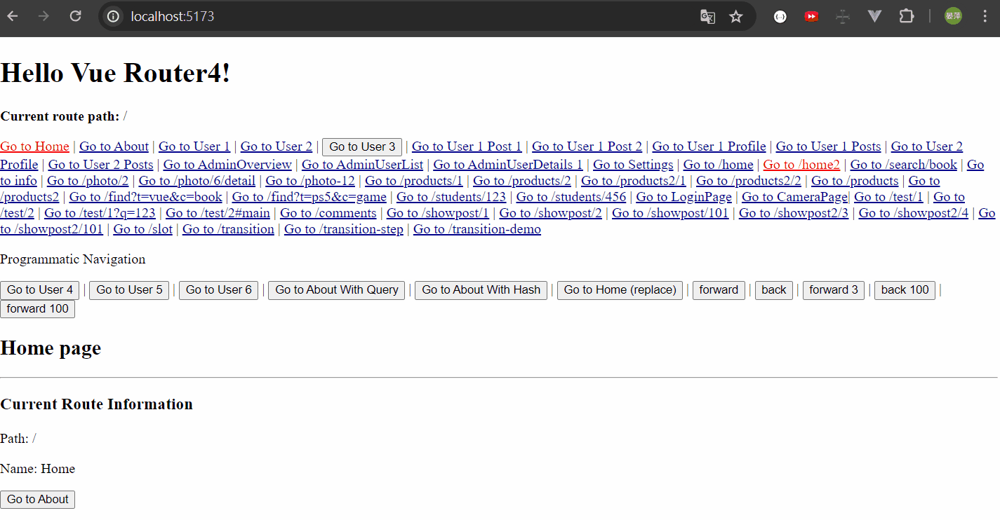

## 滾動行為 (Scroll Behavior)

使用前端路由，當切換到新路由時，想要頁面滾到頂部或是重新加載頁面時保持原先的滾動位置，可以在創建 `router` 實例時，提供一個 `scrollBehavior` 方法。

> 注意：此功能只在支持 `history.pushState` 的瀏覽器中可用。

### scrollBehavior 函數

會接收 `to` 和 `from` 兩個參數，第三個參數 `savedPosition` 只有當這是一個 `popstate` 導航時才可用 (透過瀏覽器的上一頁/下一頁按鈕或是重新整理觸發)。

> `popstate` 參考資料：[MDN](https://developer.mozilla.org/zh-TW/docs/Web/API/Window/popstate_event)。

```javascript
import { createRouter, createWebHistory } from 'vue-router';
//...

// 創建路由實例
const router = createRouter({
  // 指定模式
  history: createWebHistory(import.meta.env.BASE_URL),
  // 設定前面配置的路由
  routes,
  // 滾動行為
  scrollBehavior(to, from, savedPosition) {
    console.log('savedPosition:', savedPosition);
    // return 期望滾動到哪個的位置
  },
});

//...
```

渲染結果：

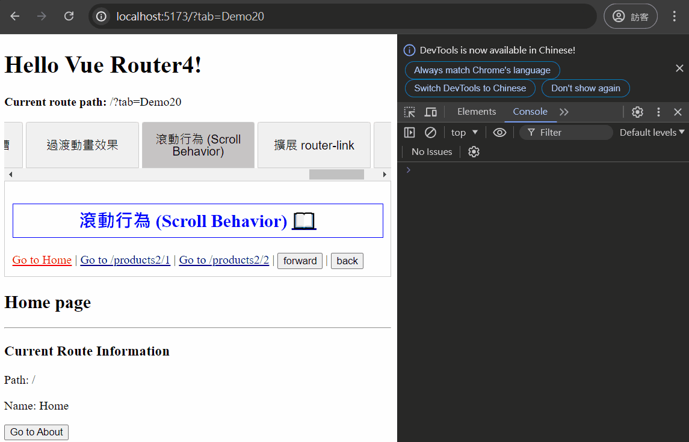

需要返回一個 [`ScrollToOptions`](https://developer.mozilla.org/en-US/docs/Web/API/Window/scroll#options) 滾動位置物件，如果返回一個 `falsy` 的值或是一個空的物件，則不會發生滾動。

```javascript
import { createRouter, createWebHistory } from 'vue-router';
//...

// 創建路由實例
const router = createRouter({
  // 指定模式
  history: createWebHistory(import.meta.env.BASE_URL),
  // 設定前面配置的路由
  routes,
  // 滾動行為
  scrollBehavior(to, from, savedPosition) {
    // 始終滾動到頂部
    return { top: 0 };
  },
});

//...
```

渲染結果：

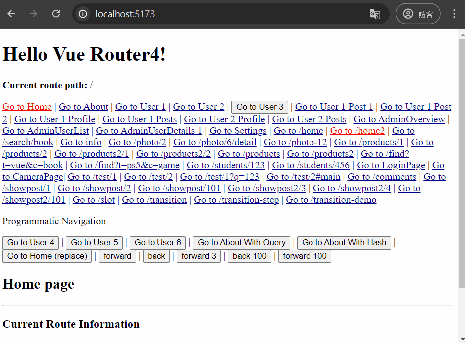

也可以通過 `el` 屬性傳遞一個 CSS 選擇器或一個 DOM 元素。在這種情況下，`top` 和 `left` 將被視為該元素的相對偏移量。

```javascript
import { createRouter, createWebHistory } from 'vue-router';
//...

// 創建路由實例
const router = createRouter({
  // 指定模式
  history: createWebHistory(import.meta.env.BASE_URL),
  // 設定前面配置的路由
  routes,
  // 滾動行為
  scrollBehavior(to, from, savedPosition) {
    // 相對 DOM 元素
    return {
      el: 'main',
      // 滾動到 main 元素上方 10 px
      top: 10,
    };
  },
});

//...
```

渲染結果：

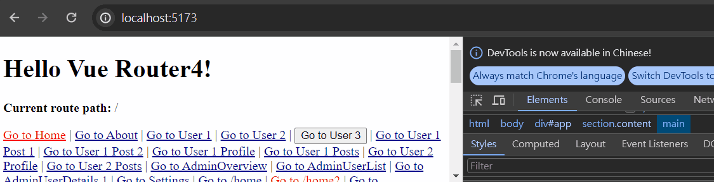

如果返回第三個參數 `savedPosition`，在按下 (上一頁/下一頁) 按鈕時，就會像瀏覽器的原生表現那樣。

```javascript
import { createRouter, createWebHistory } from 'vue-router';
//...

// 創建路由實例
const router = createRouter({
  // 指定模式
  history: createWebHistory(import.meta.env.BASE_URL),
  // 設定前面配置的路由
  routes,
  // 滾動行為
  scrollBehavior(to, from, savedPosition) {
    // 返回 savedPosition
    if (savedPosition) {
      return savedPosition;
    } else {
      return { top: 0 };
    }
  },
});

//...
```

渲染結果：

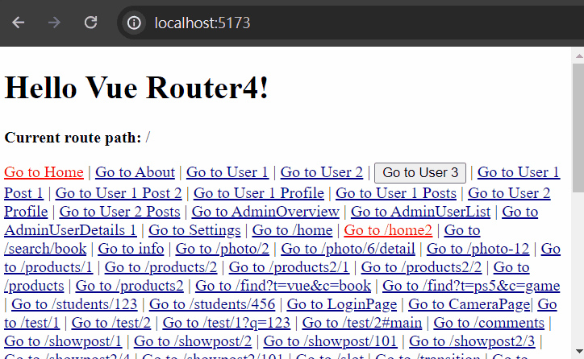

以下範例模擬模擬滾動到錨點的行為。

```javascript
import { createRouter, createWebHistory } from 'vue-router';
//...

// 配置路由規則
const routes = [
  //...
  // Hash page
  {
    path: '/hashpage',
    name: 'HashPage',
    component: () => import('@/views/HashPage.vue'),
  },
  //...
];

// 創建路由實例
const router = createRouter({
  // 指定模式
  history: createWebHistory(import.meta.env.BASE_URL),
  // 設定前面配置的路由
  routes,
  // 滾動行為
  scrollBehavior(to, from, savedPosition) {
    // 模擬滾動到錨點
    if (to.hash) {
      return { el: to.hash };
    }
  },
});

//...
```

HashPage.vue 頁面：

```vue
<template>
  <h2>Hash page</h2>
  <hr />
  <router-link :to="{ name: 'HashPage', hash: '#hash1' }"
    >Go to /hashpage#hash1</router-link
  >
  |
  <router-link :to="{ name: 'HashPage', hash: '#hash2' }"
    >Go to /hashpage#hash2</router-link
  >
  <h3 id="hash1">Hash 1</h3>
  <p>
    Lorem ipsum dolor sit amet consectetur adipisicing elit. Consequuntur
    veritatis dolore culpa quia debitis soluta saepe reprehenderit natus sequi
    reiciendis et itaque nam, ipsa rem molestias, molestiae cumque velit iure.
  </p>

  <h3 id="hash2">Hash 2</h3>
  <p>
    Lorem ipsum dolor sit amet consectetur adipisicing elit. Consequuntur
    veritatis dolore culpa quia debitis soluta saepe reprehenderit natus sequi
    reiciendis et itaque nam, ipsa rem molestias, molestiae cumque velit iure.
  </p>
</template>

<style scoped>
h3 {
  color: darkcyan;
  border-bottom: 2px solid darkcyan;
}

p {
  width: 300px;
  padding: 10px;
  background-color: lightcyan;
  min-height: 600px;
}
</style>
```

渲染結果：

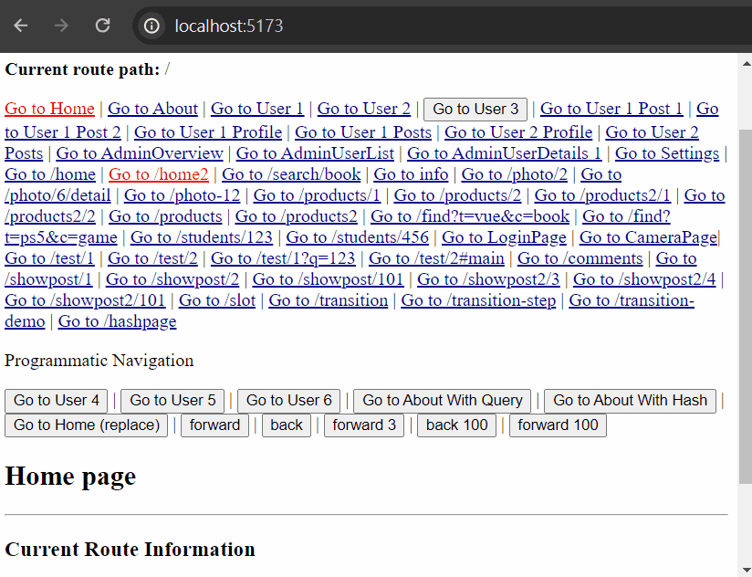

如果瀏覽器支持滾動行為，可以設置 `smooth` 讓它更流暢。

```javascript
import { createRouter, createWebHistory } from 'vue-router';
//...

// 創建路由實例
const router = createRouter({
  // 指定模式
  history: createWebHistory(import.meta.env.BASE_URL),
  // 設定前面配置的路由
  routes,
  // 滾動行為
  scrollBehavior(to, from, savedPosition) {
    // 設置 behavior: 'smooth' 讓滾動更流暢
    if (to.hash) {
      return {
        el: to.hash,
        behavior: 'smooth',
      };
    }
  },
});

//...
```

渲染結果：

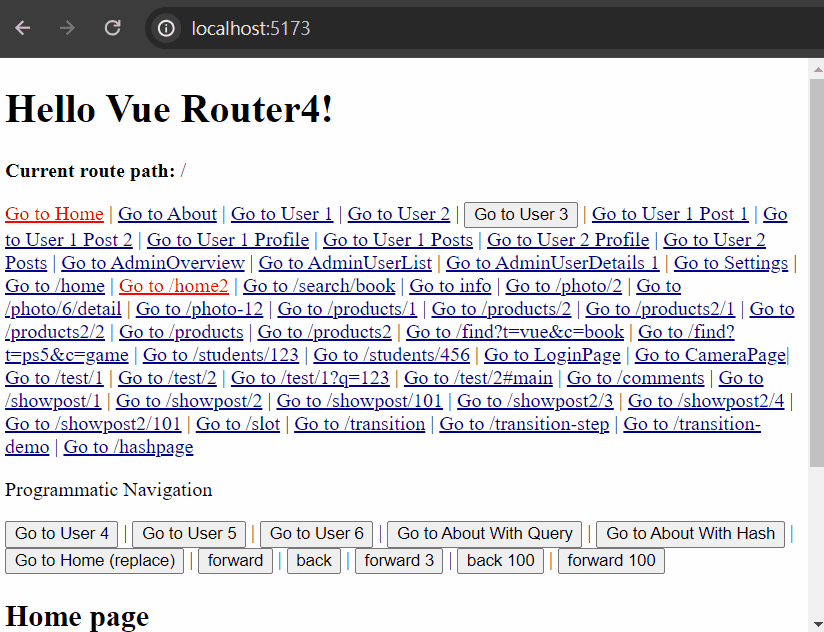

---

### 延遲滾動

有時候需要在頁面中滾動之前稍微等待，例如：處理頁面過渡時，希望等待過渡結束後再滾動，可以透過返回一個 `Promise`，它可以返回所需的位置物件。

以下範例在滾動前等待 500ms。

```javascript
import { createRouter, createWebHistory } from 'vue-router';
//...

// 創建路由實例
const router = createRouter({
  // 指定模式
  history: createWebHistory(import.meta.env.BASE_URL),
  // 設定前面配置的路由
  routes,
  // 滾動行為
  scrollBehavior(to, from, savedPosition) {
    // 延遲滾動
    return new Promise((resolve, reject) => {
      setTimeout(() => {
        resolve({ top: 0, left: 0 });
      }, 500);
    });
  },
});

//...
```

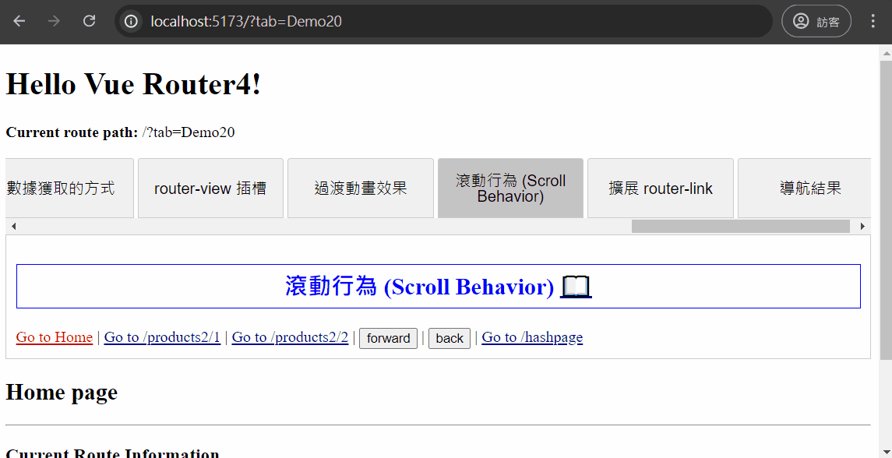

## 擴展 router-link

可以透過擴展來自定義 `<router-link>` 組件，方便在整個應用中重複使用它們。例如處理外部連結或是添加而外的 `props` 等等。

詳細介紹可以查看此[官方文檔](https://router.vuejs.org/guide/advanced/extending-router-link.html)。

以下範例為自定義一個處理外部連結以及樣式的 `<router-link>` 組件。

- 設置 AppLink.vue 自定義連結：

  新增 `inactiveClass` prop，以及根據是否為外部連結進行對應的模板渲染，並且透過在 `<router-link>` 組件上設定 `custom`、`v-slot` 來自定義連結。

  > 補充：[`v-bind="$props"`](https://medium.com/vuejs-tips/v-bind-props-1649cbd5f034)、[`startsWith()`](https://developer.mozilla.org/en-US/docs/Web/JavaScript/Reference/Global_Objects/String/startsWith)。

  ```vue
  <script setup>
  import { RouterLink } from 'vue-router';
  import { computed } from 'vue';

  // 關閉 Attributes 繼承
  defineOptions({
    inheritAttrs: false,
  });

  // 新增設置 props
  const props = defineProps({
    ...RouterLink.props,
    inactiveClass: String,
  });

  // 是否為外部連結
  const isExternalLink = computed(() => {
    return typeof props.to == 'string' && props.to.startsWith('http');
  });
  </script>

  <template>
    <a
      v-if="isExternalLink"
      v-bind="$attrs"
      :href="props.to"
      :class="inactiveClass"
      target="_blank"
      ><slot
    /></a>
    <router-link
      v-else
      v-bind="$props"
      custom
      v-slot="{
        // the resolved route object
        route,
        // the href to use in a link
        href,
        // boolean ref indicating if the link is active
        isActive,
        // boolean ref indicating if the link is exactly active
        isExactActive,
        // function to navigate to the link
        navigate,
      }"
    >
      <a
        v-bind="$attrs"
        :href="href"
        @click="navigate"
        :class="[
          isActive ? activeClass : inactiveClass,
          isExactActive ? exactActiveClass : '',
        ]"
      >
        <slot />
      </a>
    </router-link>
  </template>
  ```

- 設置 CustomLink.vue：

  使用 `AppLink` 組件並指定對應的 class 樣式。

  ```vue
  <script setup>
  import AppLink from '@/components/AppLink.vue';
  </script>

  <template>
    <AppLink
      v-bind="$attrs"
      class="custom-link"
      active-class="custom-link-active-green"
      exact-active-class="custom-link-exact-active-green"
      inactive-class="custom-link-inactive"
    >
      <slot />
    </AppLink>
  </template>

  <!-- 添加連結樣式 -->
  <style>
  /* 添加指定連結樣式 */
  .custom-link {
    font-size: 30px;
    text-decoration: none;
    margin-right: 10px;
  }
  .custom-link:hover {
    text-decoration: underline;
  }
  .custom-link-active-green {
    color: orange;
  }
  .custom-link-exact-active-green {
    color: darkgoldenrod;
  }
  .custom-link-inactive {
    color: darkslategrey;
  }
  </style>
  ```

- App.vue 中使用 `CustomLink` 組件：

  ```vue
  <template>
    <!-- 省略 -->

    <section>
      <p>Custom Link：</p>
      <CustomLink to="https://www.google.com/">Go to google</CustomLink>
      <CustomLink :to="{ name: 'User', params: { userId: '1' } }"
        >Go to User 1</CustomLink
      >
      <CustomLink to="/users/1/profile">Go to User 1 Profile</CustomLink>
    </section>

    <!-- 省略 -->
  </template>
  ```

- 渲染結果：

  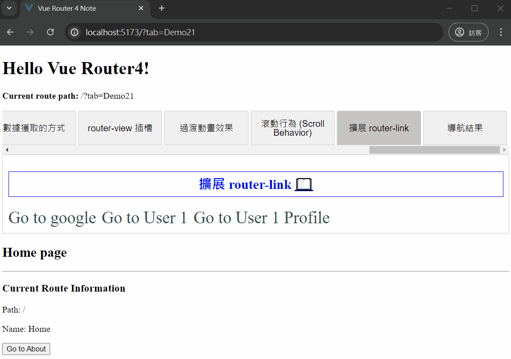

## 導航結果

當使用 `<router-link>` 組件時，Vue Router 會自動調用 `router.push` 來觸發一次導航。正常情況會依照預期的將使用者導航到一個新的頁面，但也有少數情況下使用者將會留在同一個頁面：

- 使用者已經位於嘗試導航到的頁面。

- 一個導航守衛通過調用 `return false` 中斷了這次導航。

- 當前的導航守衛還沒有完成時，一個新的導航守衛出現了。

- 一個導航守衛通過返回一個新的位置，重新導向到其他地方 (例如：`return '/login'`)。

- 一個導航守衛拋出了一個 `Error`。

假設我們需要在導航到新頁面後隱藏選單，以下寫法將會馬上關閉選單。

```javascript
function goToPath(path) {
  router.push(path);
  closeModal();
}
function closeModal() {
  isModalOpen.set(false);
}
```

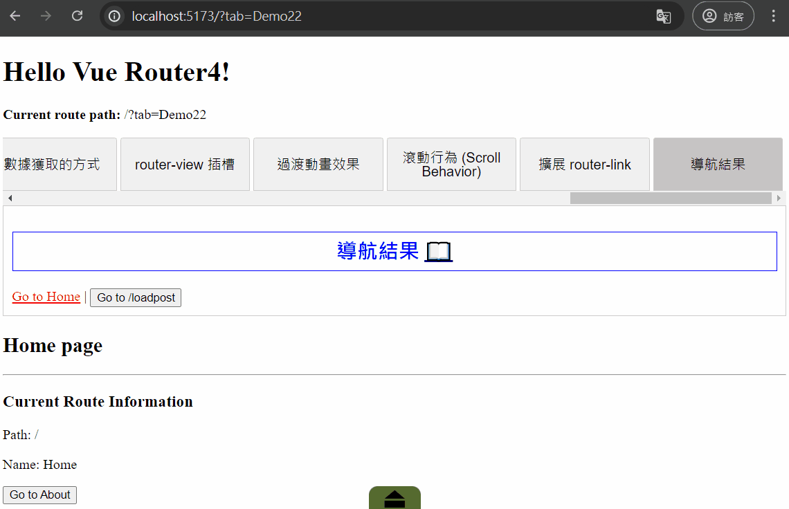

因為導航是異步的，所以需要 `await` `router.push` 返回的 `Promise`，現在當導航完成，選單就會關閉。

```javascript
async function goToPath(path) {
  await router.push(path);
  closeModal();
}
function closeModal() {
  isModalOpen.set(false);
}
```


但如果導航被阻止，選單也還是會跟著關閉。


---

### 檢測導航 Failure

當導航被阻止導致使用者停留在同一個頁面上時，`router.push` 返回的 `Promise` 解析值將會是 `Navigation Failure`，否則它將是一個 `falsy` 值 (通常為 `undefined`)。

因此可以以此區分是否成功導航到新頁面，來正確的關閉選單。

```javascript
async function goToPath(path) {
  const failure = await router.push(path);
  if (failure) {
    // 導航被阻止
  } else {
    // 導航成功關閉選單
    closeModal();
  }
}
function closeModal() {
  isModalOpen.set(false);
}
```

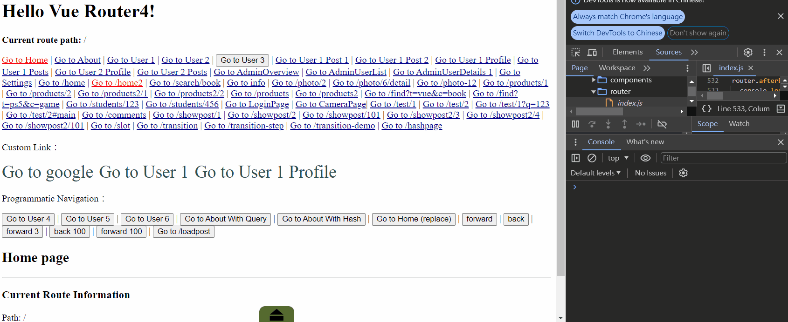

`Navigation Failure` 是帶有額外屬性的 `Error` 實例，可以根據這些屬性提供的信息知道哪些導航被阻止了以及為什麼被阻止。

要檢查導航結果的性質，可以使用 `isNavigationFailure` 函數，若忽略第二個參數，只使用 `isNavigationFailure(failure)`，將只會檢查 `failure` 是否為一個 `Navigation Failure`。

#### § 導航失敗類型 NavigationFailureType

- aborted

  在導航守衛中返回 `false` 中斷了本次導航。

- cancelled

  在當前的導航還沒有完成時又有了一個新的導航。例如：在等待導航守衛的過程中又調用了 `router.push`。

- duplicated

  導航被阻止，因為已經在目標位置了。

```javascript
import { isNavigationFailure, NavigationFailureType } from 'vue-router';

// 檢測導航結果
async function goToPath(path) {
  const failure = await router.push(path);
  if (isNavigationFailure(failure, NavigationFailureType.aborted)) {
    // 導航被阻止，給使用者顯示一個提示
    alert('Navigation Failure aborted');
  } else if (isNavigationFailure(failure, NavigationFailureType.duplicated)) {
    // 導航重複
    alert('Navigation Failure duplicated');
  } else {
    // 導航成功關閉選單
    closeModal();
  }
}
function closeModal() {
  isModalOpen.set(false);
}
```

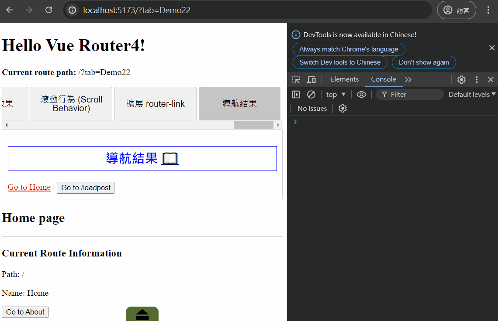

---

### 全局檢測導航是否失敗

可以使用 `router.afterEach()` 檢測，接收 `Navigation Failure` 作為第三個參數，表示路由跳轉失敗。

```javascript
import { createRouter, createWebHistory } from 'vue-router';
//...

// 創建路由實例
const router = createRouter({
  //...
});

//...

// 全局後置鉤子
router.afterEach((to, from, failure) => {
  console.log('router afterEach--');
  if (failure) {
    // 重複路由不顯示錯誤
    if (!isNavigationFailure(failure, NavigationFailureType.duplicated)) {
      sendToAnalytics(to, from, failure);
    }
  }
});

function sendToAnalytics(to, from, failure) {
  console.log('sendToAnalytics---', failure);
}

//...
```

---

### 導航失敗的屬性

所有的導航失敗都會暴露 `to` 和 `from` 屬性，可以反映失敗導航的當前位置和目標位置。

```javascript
import { isNavigationFailure, NavigationFailureType } from 'vue-router';

// 檢測導航結果
async function goToPath(path) {
  const failure = await router.push(path);
  if (isNavigationFailure(failure, NavigationFailureType.aborted)) {
    // 導航被阻止，給使用者顯示一個提示
    alert('Navigation Failure aborted');
    console.log(
      `Failure -- to: ${failure.to.path}, from: ${failure.from.path}`
    );
  } else if (isNavigationFailure(failure, NavigationFailureType.duplicated)) {
    // 導航重複
    alert('Navigation Failure duplicated');
  } else {
    // 導航成功關閉選單
    closeModal();
  }
}
function closeModal() {
  isModalOpen.set(false);
}
```


---

### 檢測重新導向

當在導航守衛中返回一個新的位置時，會觸發一個新的導航來覆蓋正在進行的導航。

與其它返回值不同的是，**重新導向不會阻止導航，而是創建一個新的導航**，因此可以通過讀取路由地址中的 `redirectedFrom` 屬性，對其進行不同的檢查。

```javascript
async function goToHome() {
  await router.push('/home');
  const redirectedFrom = router.currentRoute.value.redirectedFrom;
  if (redirectedFrom) {
    // redirectedFrom 是解析出的路由地址，就像導航守衛中的 to 和 from
    console.log('redirectedFrom: ', redirectedFrom);
  }
}
```

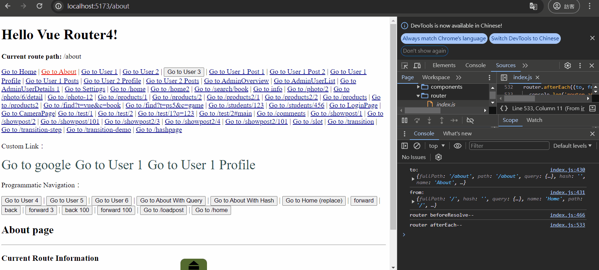

## 動態路由

[💻Demo](https://vue-router-dynamic.vercel.app/) | [📝Code](https://github.com/YPINPIN/vue-router-dynamic)

對路由的添加通常是通過 `routes` 選項來配置的，但是在某些情況下可能想要**在應用程式運行中動態的添加或刪除路由**。

### 初始路由

使用 `routes` 選項來配置初始路由。

- 路由配置 (router/index.js)：

  ```javascript
  import { createRouter, createWebHistory } from 'vue-router';

  // 配置路由規則
  const routes = [
    {
      path: '/',
      name: 'Home',
      component: () => import('@/views/Home.vue'),
    },
    // 設置 404 NotFound 頁面
    {
      path: '/:pathMatch(.*)',
      name: 'NotFound',
      component: () => import('@/views/NotFound.vue'),
    },
  ];

  // 創建路由實例
  const router = createRouter({
    // 指定模式
    history: createWebHistory(import.meta.env.BASE_URL),
    // 設定前面配置的路由
    routes,
  });

  // 共享路由實例
  export default router;
  ```

- Home.vue：

  ```vue
  <template>
    <h2>Home page</h2>
  </template>
  ```

- NotFound.vue：

  ```vue
  <script setup>
  import { useRoute } from 'vue-router';
  const route = useRoute();
  </script>

  <template>
    <h2>404 Not Found.</h2>
    <p>path: /{{ route.params.pathMatch }}</p>
  </template>
  ```

- App.vue：

  ```vue
  <template>
    <h1>Hello Vue Router4!</h1>
    <p><strong>Current route path:</strong> {{ $route.fullPath }}</p>
    <hr />

    <nav>
      <router-link to="/">Go to Home</router-link> |
      <router-link to="/about">Go to About</router-link> |
      <router-link to="/admin">Go to Admin</router-link>
    </nav>

    <main>
      <router-view />
    </main>
  </template>

  <style scoped>
  main {
    margin-top: 5px;
    padding: 10px;
    background-color: lightblue;
  }
  </style>
  ```

渲染結果：

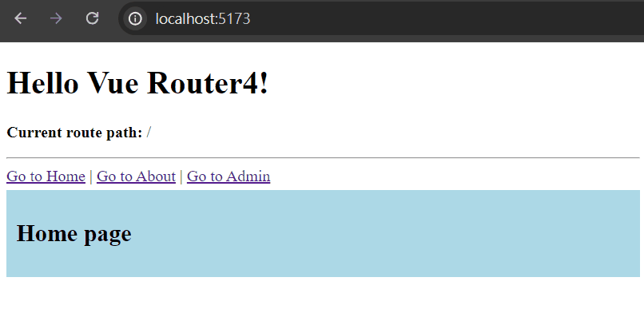

---

### 查看現有路由

- `router.hasRoute()`

  檢查路由是否存在，傳入 `name` (要檢查的路由名稱)，返回 `boolean`。

- `router.getRoutes()`

  獲取一個包含所有路由配置的陣列。

---

### 添加一級路由

透過 `router.addRoute()` 可以動態的添加路由。

- App.vue：

  ```vue
  <script setup>
  import { useRouter } from 'vue-router';
  import { onMounted } from 'vue';

  const router = useRouter();

  function addNormalRoutes() {
    // 添加一級路由
    router.addRoute({
      path: '/about',
      name: 'About',
      component: () => import('@/views/About.vue'),
    });
    router.addRoute({
      path: '/admin',
      name: 'Admin',
      component: () => import('@/views/AdminTip.vue'),
    });
    // 獲取一個包含所有路由配置的陣列
    console.log('allRoutes: ', router.getRoutes());
  }

  onMounted(() => {
    console.log('onMounted');
    addNormalRoutes();
  });
  </script>

  <!-- 省略 -->
  ```

- About.vue：

  ```vue
  <template>
    <h2>About page</h2>
  </template>
  ```

- AdminTip.vue：

  ```vue
  <template>
    <h2>Admin page</h2>
    <section>
      <p>Please Login first.</p>
    </section>
  </template>

  <style scoped>
  section {
    padding: 10px;
    background-color: darkgoldenrod;
  }
  </style>
  ```

渲染結果：


需要特別注意，若是在動態添加的路由(例如：`/about` )下添加新路由，**則必須要手動調用 `router.replace()` 來改變當前的位置來顯示對應頁面**。

以上的範例中未手動調用 `router.replace()` 時會無法獲取到新添加的路由頁面：

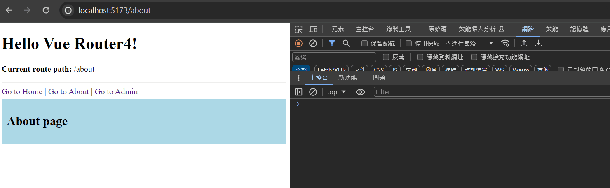

修改未添加路由時對應到的 NotFound.vue 頁面：

```vue
<script setup>
import { useRoute, useRouter } from 'vue-router';
const route = useRoute();
const router = useRouter();
// 需要手動調用 router.replace() 來改變當前的位置顯示對應頁面
router.replace(route.fullPath);
</script>

<template>
  <h2>404 Not Found.</h2>
  <p>path: /{{ route.params.pathMatch }}</p>
</template>
```


---

### 刪除路由

有以下幾種不同的方法來刪除現有的路由。

> 注意：當路由被刪除時，所有的別名及子路由也會被同時刪除。

#### § 1. 可以通過使用 `router.removeRoute()` 按名稱刪除路由

可以使用 `router.hasRoute()` 先檢查路由是否存在，再調用 `router.removeRoute()` 按名稱刪除路由。

- App.vue：

  ```vue
  <script setup>
  import { useRouter } from 'vue-router';
  import { onMounted } from 'vue';

  const router = useRouter();

  function addNormalRoutes() {
    // 添加一級路由
    router.addRoute({
      path: '/about',
      name: 'About',
      component: () => import('@/views/About.vue'),
    });
    router.addRoute({
      path: '/admin',
      name: 'Admin',
      component: () => import('@/views/AdminTip.vue'),
    });

    // 使用 hasRoute 檢查路由是否存在
    if (router.hasRoute('Admin')) {
      // 1. 可以通過使用 router.removeRoute() 按名稱刪除路由
      router.removeRoute('Admin');
    }

    // 獲取一個包含所有路由配置的陣列
    console.log('allRoutes: ', router.getRoutes());
  }

  onMounted(() => {
    console.log('onMounted');
    addNormalRoutes();
  });
  </script>

  <!-- 省略 -->
  ```

- 渲染結果：

  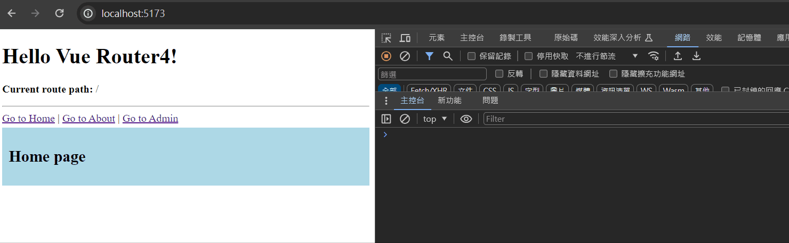

#### § 2. 通過添加一個名稱衝突的路由

若重複添加相同 `name` 的路由，則會先刪除原路由，再添加新路由。

- App.vue：

  ```vue
  <script setup>
  import { useRouter } from 'vue-router';
  import { onMounted, ref } from 'vue';

  const router = useRouter();
  // 是否為 Admin
  const isAdmin = ref(localStorage.getItem('isAdmin'));

  function addNormalRoutes() {
    // 省略
  }

  function addAdminRoutes() {
    if (!router.hasRoute('About')) {
      router.addRoute({
        path: '/about',
        name: 'About',
        component: () => import('@/views/About.vue'),
      });
    }
    // 2. 若重複添加相同 name 的路由，則會先刪除原路由，再添加新路由
    router.addRoute({
      path: '/admin',
      name: 'Admin',
      component: () => import('@/views/Admin.vue'),
    });

    // 獲取一個包含所有路由配置的陣列
    console.log('allRoutes: ', router.getRoutes());
  }

  onMounted(() => {
    console.log('onMounted');
    isAdmin.value ? addAdminRoutes() : addNormalRoutes();
  });

  function login() {
    console.log('login');
    localStorage.setItem('isAdmin', true);
    isAdmin.value = true;
    addAdminRoutes();
    // 需要手動調用 router.replace() 來改變當前的位置顯示對應頁面
    router.replace(router.currentRoute.value.fullPath);
  }
  function logout() {
    console.log('logout');
    localStorage.removeItem('isAdmin');
    isAdmin.value = null;
    addNormalRoutes();
    // 需要手動調用 router.replace() 來改變當前的位置顯示對應頁面
    router.replace(router.currentRoute.value.fullPath);
  }
  </script>

  <template>
    <h1>Hello Vue Router4!</h1>
    <p><strong>Current route path:</strong> {{ $route.fullPath }}</p>
    <button v-if="isAdmin" @click="logout">Admin Logout</button>
    <button v-else @click="login">Admin Login</button>
    <hr />

    <nav>
      <router-link to="/">Go to Home</router-link> |
      <router-link to="/about">Go to About</router-link> |
      <router-link to="/admin">Go to Admin</router-link>
    </nav>

    <main>
      <router-view />
    </main>
  </template>

  <style scoped>
  main {
    margin-top: 5px;
    padding: 10px;
    background-color: lightblue;
  }
  </style>
  ```

- Admin.vue：

  ```vue
  <template>
    <h2>Admin page</h2>
    <section>
      <p>Hello Admin.</p>
    </section>
  </template>

  <style scoped>
  section {
    padding: 10px;
    background-color: darkcyan;
  }
  </style>
  ```

- 渲染結果：

  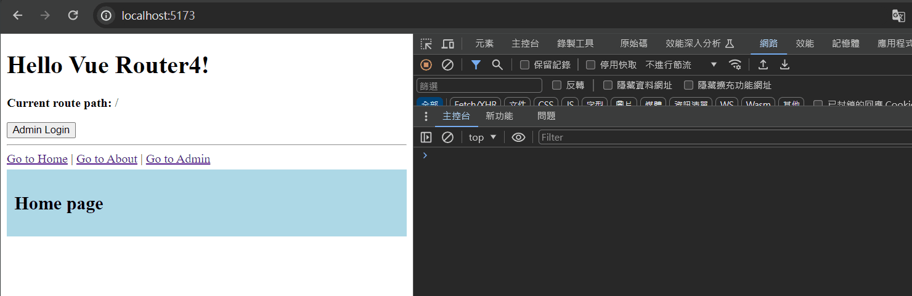

#### § 3. 通過調用 `router.addRoute()` 返回的回調

當路由沒有名稱時，可以通過調用 `router.addRoute()` 返回的回調來刪除對應的路由。

- App.vue：

  ```vue
  <script setup>
  // 省略

  function addNormalRoutes() {
    // 添加一級路由
    router.addRoute({
      path: '/about',
      name: 'About',
      component: () => import('@/views/About.vue'),
    });
    const removeRoute = router.addRoute({
      path: '/admin',
      name: 'Admin',
      component: () => import('@/views/AdminTip.vue'),
    });

    // // 使用 hasRoute 檢查路由是否存在
    // if (router.hasRoute('Admin')) {
    //   // 1. 可以通過使用 router.removeRoute() 按名稱刪除路由
    //   router.removeRoute('Admin');
    // }

    // 3. 可以通過調用 `router.addRoute()` 返回的回調來刪除對應的路由
    removeRoute();

    // 獲取一個包含所有路由配置的陣列
    console.log('allRoutes: ', router.getRoutes());
  }

  function addAdminRoutes() {
    // 省略
  }

  // 省略
  </script>

  <!-- 省略 -->
  ```

- 渲染結果：

  

---

### 添加巢狀路由

可以將現有路由的 `name` 作為第一個參數傳遞給 `router.addRoute()`，將路由添加到現有的路由中，等同於使用 `children` 添加。

- App.vue：

  ```vue
  <script setup>
  import { useRouter } from 'vue-router';
  import { onMounted, ref } from 'vue';

  const router = useRouter();
  // 是否為 Admin
  const isAdmin = ref(localStorage.getItem('isAdmin'));

  // 紀錄刪除路由函數(router.addRoute() 返回的回調)
  const rmRoutes = ref([]);
  // 添加刪除路由函數
  function addRmRoutes(fn) {
    rmRoutes.value.push(fn);
  }
  // 通過調用 router.addRoute() 返回的回調刪除路由，如果存在的話
  function removeRoutes() {
    rmRoutes.value.forEach((fn) => fn());
  }

  function addNormalRoutes() {
    // 添加一級路由
    router.addRoute({
      path: '/about',
      name: 'About',
      component: () => import('@/views/About.vue'),
    });
    const removeRoute = router.addRoute({
      path: '/admin',
      name: 'Admin',
      component: () => import('@/views/AdminTip.vue'),
    });

    // // 使用 hasRoute 檢查路由是否存在
    // if (router.hasRoute('Admin')) {
    //   // 1. 可以通過使用 router.removeRoute() 按名稱刪除路由
    //   router.removeRoute('Admin');
    // }

    // // 3. 可以通過調用 `router.addRoute()` 返回的回調來刪除對應的路由
    // removeRoute();

    // 獲取一個包含所有路由配置的陣列
    console.log('allRoutes: ', router.getRoutes());
  }

  function addAdminRoutes() {
    if (!router.hasRoute('About')) {
      router.addRoute({
        path: '/about',
        name: 'About',
        component: () => import('@/views/About.vue'),
      });
    }
    // 2. 若重複添加相同 name 的路由，則會先刪除原路由，再添加新路由
    router.addRoute({
      path: '/admin',
      name: 'Admin',
      component: () => import('@/views/Admin.vue'),
    });

    // 紀錄刪除路由函數，方便切換權限時刪除路由
    addRmRoutes(
      // 添加巢狀路由
      router.addRoute('Admin', {
        path: '',
        name: 'AdminInfo',
        component: () => import('@/views/AdminInfo.vue'),
      })
    );
    addRmRoutes(
      router.addRoute('Admin', {
        path: 'settings',
        name: 'AdminSettings',
        component: () => import('@/views/AdminSettings.vue'),
      })
    );

    // 獲取一個包含所有路由配置的陣列
    console.log('allRoutes: ', router.getRoutes());
  }

  onMounted(() => {
    console.log('onMounted');
    isAdmin.value ? addAdminRoutes() : addNormalRoutes();
  });

  function login() {
    console.log('login');
    localStorage.setItem('isAdmin', true);
    isAdmin.value = true;
    // 刪除路由
    removeRoutes();
    addAdminRoutes();
    // 需要手動調用 router.replace() 來改變當前的位置顯示對應頁面
    router.replace(router.currentRoute.value.fullPath);
  }
  function logout() {
    console.log('logout');
    localStorage.removeItem('isAdmin');
    isAdmin.value = null;
    // 刪除路由
    removeRoutes();
    addNormalRoutes();
    // 需要手動調用 router.replace() 來改變當前的位置顯示對應頁面
    router.replace(router.currentRoute.value.fullPath);
  }
  </script>

  <template>
    <h1>Hello Vue Router4!</h1>
    <p><strong>Current route path:</strong> {{ $route.fullPath }}</p>
    <button v-if="isAdmin" @click="logout">Admin Logout</button>
    <button v-else @click="login">Admin Login</button>
    <hr />

    <nav>
      <router-link to="/">Go to Home</router-link> |
      <router-link to="/about">Go to About</router-link> |
      <router-link to="/admin">Go to Admin</router-link>
      <template v-if="isAdmin">
        |
        <router-link to="/admin/settings">Go to AdminSettings</router-link>
      </template>
    </nav>

    <main>
      <router-view />
    </main>
  </template>

  <style scoped>
  main {
    margin-top: 5px;
    padding: 10px;
    background-color: lightblue;
  }
  </style>
  ```

- Admin.vue：

  ```vue
  <template>
    <h2>Admin page</h2>
    <section>
      <router-view></router-view>
    </section>
  </template>

  <style scoped>
  section {
    padding: 10px;
    background-color: darkcyan;
  }
  </style>
  ```

- AdminInfo.vue：

  ```vue
  <template>
    <h3>AdminInfo page</h3>
  </template>
  ```

- AdminSettings.vue：

  ```vue
  <template>
    <h3>AdminSettings page</h3>
  </template>
  ```

- 渲染結果：

  
