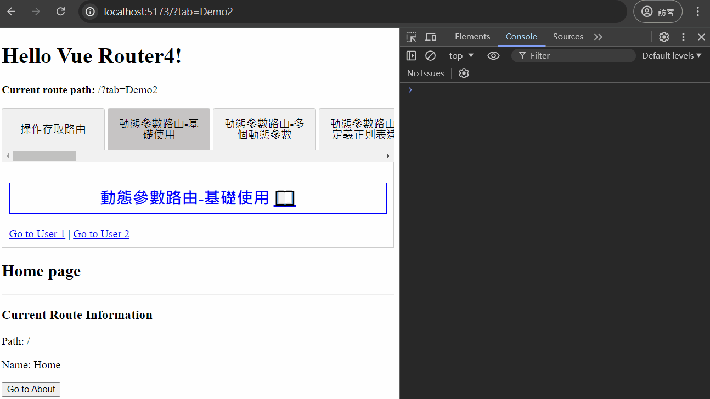
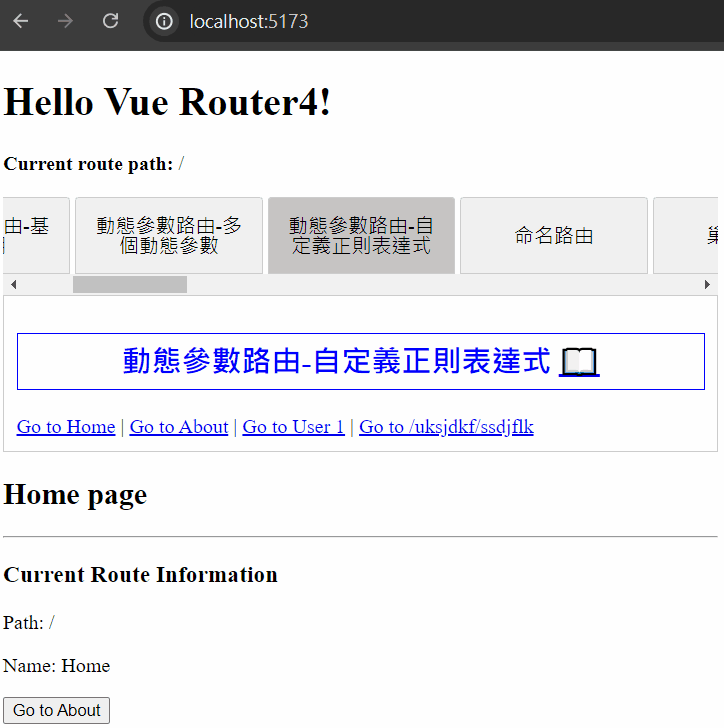
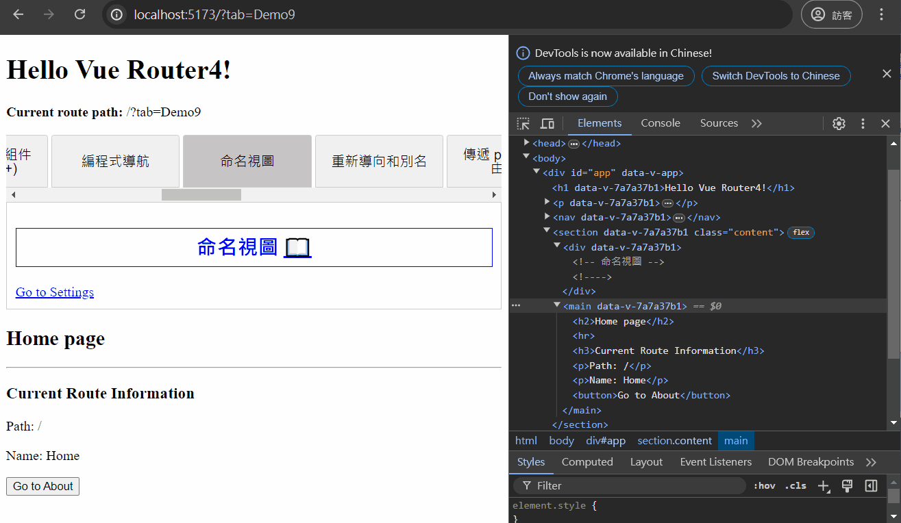

# Vue Router 4 學習筆記

主要根據 Vue Router 4 官方文檔整理的學習筆記，方便查閱。

## 官方文檔

> https://router.vuejs.org/ <br> https://router.vuejs.org/zh/

## 目錄

- [安裝 Vue Router](#安裝-vue-router)

- [基礎配置](#基礎配置)

- [操作存取路由](#操作存取路由)

- [動態參數路由](#動態參數路由)

  - [基礎使用](#基礎使用)

  - [多個動態參數](#多個動態參數)

  - [使用自定義正則表達式](#使用自定義正則表達式)

- [命名路由](#命名路由)

- [巢狀路由](#巢狀路由)

- [編程式導航](#編程式導航)

- [命名視圖](#命名視圖)

## 安裝 Vue Router

### 1. 基於 Vite 創建新專案

在環境安裝時選擇添加使用 Vue Router 即可。

```bash
npm create vue@latest
```


Vue Router 相關文件夾：


項目運行結果：


### 2. 現有專案新增安裝

安裝完成後需要自己配置相關文件，參考下面的[基礎配置](#基礎配置)。

```bash
npm install vue-router@4
```


## 基礎配置

### 1. 新增路由頁面文件

在 src 下建立 views 資料夾，通常路由相關的頁面會放置在此。


views 資料夾下新增 Home、About 頁面：

- Home.vue

  ```vue
  <template>
    <h2>Home page</h2>
  </template>
  ```

- About.vue

  ```vue
  <template>
    <h2>About page</h2>
  </template>
  ```


### 2. 創建路由配置文件

在 src 下建立 router 資料夾，並新增 index.js 文件。


設定路由配置 index.js：

> 動態導入(懶加載)相關介紹可以查看此[官方文檔](https://router.vuejs.org/zh/guide/advanced/lazy-loading.html)。

```javascript
import { createRouter, createWebHistory } from 'vue-router';
// 靜態導入
import Home from '@/views/Home.vue';

// 配置路由規則
const routes = [
  {
    path: '/',
    name: 'Home',
    component: Home,
  },
  {
    path: '/about',
    name: 'About',
    // 動態導入(懶加載)
    component: () => import('@/views/About.vue'),
  },
];

// 創建路由實例
const router = createRouter({
  // 指定模式
  history: createWebHistory(import.meta.env.BASE_URL),
  // 設定前面配置的路由
  routes,
});

// 共享路由實例
export default router;
```

### 3. main.js 引入並使用路由實例

```javascript
import { createApp } from 'vue';
import App from './App.vue';
import router from './router';

const app = createApp(App);

app.use(router);

app.mount('#app');
```

### 4. App.vue 內設定路由連結及顯示

Vue Router 提供了 `<router-link>` 及 `<router-view>` 兩個全域註冊的組件：

- `<router-link>` 組件

  創建路由連結，也可以使用 `<RouterLink>`。

  屬性：

  - to -> 跳轉的路由地址，值為字串或一個物件。

  - replace -> 設置後，會調用 `router.replace()` 而不是 `router.push()`。

    > `replace` 沒有歷史紀錄不可返回，`push` 可以返回。

  - active-class -> 設置連結配對後應用的 class，默認為 `router-link-active`。

  - exact-active-class -> 設置連結準確配對時應用的 class，默認為 `router-link-exact-active`。

- `<router-view>` 組件

  **顯示路由切換頁面的地方**，也可以使用 `<RouterView>`。

設置 App.vue：

```vue
<script setup></script>

<template>
  <h1>Hello Vue Router4!</h1>
  <p><strong>Current route path:</strong> {{ $route.fullPath }}</p>

  <nav>
    <router-link to="/">Go to Home</router-link> |
    <router-link to="/about">Go to About</router-link>
  </nav>

  <main>
    <router-view />
  </main>
</template>
```

> 在模板中也可以透過 `$route` 來獲取當前路由資料。

### 5. 運行專案結果


## 操作存取路由

在組件中我們可以透過幾個方法獲取路由實例和當前路由資料。

### 1. `<template>` 模板中

在組件模板中可以透過 `$router`、`$route` 操作存取路由。

- `$router` -> 路由實例，可以用來進行動態的路由操作。

- `$route` -> 包含當前路由資料的物件

About.vue 模板中操作存取路由：

```vue
<template>
  <h2>About page</h2>
  <hr />
  <h3>Current Route Information</h3>
  <p>Path: {{ $route.path }}</p>
  <p>Path: {{ $route.name }}</p>

  <button @click="$router.push('/')">Back to Home</button>
</template>
```

渲染結果：


### 2. `<script setup>` 中

在 `<script setup>` 中則可以透過使用 `useRouter()`、`useRoute()` 來執行相同的功能。

- `useRouter()` -> 獲取路由實例，可以用來進行動態的路由操作。

- `useRoute()` -> 返回包含當前路由資料的物件

Home.vue `<script setup>` 中操作存取路由：

```vue
<script setup>
import { useRouter, useRoute } from 'vue-router';

const router = useRouter();
const route = useRoute();
</script>

<template>
  <h2>Home page</h2>
  <hr />
  <h3>Current Route Information</h3>
  <p>Path: {{ route.path }}</p>
  <p>Name: {{ route.name }}</p>

  <button @click="router.push('/about')">Go to About</button>
</template>
```

渲染結果：


## 動態參數路由

當需要在**同一規則的路由中對應到相同的頁面組件**時，例如一個 User 組件會根據不同的 userId 渲染不同的 User 資料，這時候就可以使用動態參數路由來實現。

將路由中動態參數的部分使用 `:` 開頭命名，當路由匹配時，動態參數的值將會透過 `route.params` 暴露給組件使用，取得對應的 `params` 後即可以搭配 API 取得特定資料顯示在頁面上。

### 基礎使用

#### § 1. 動態參數路由配置 (router/index.js)

```javascript
//...

// 配置路由規則
const routes = [
  //...
  {
    path: '/users/:userId',
    name: 'User',
    component: () => import('@/views/User.vue'),
  },
];

//...
```

#### § 2. 設置路由切換 (App.vue)

```vue
<template>
  <!-- 省略前面 -->

  <nav>
    <!-- 省略前面 -->
    <router-link to="/users/1">Go to User 1</router-link> |
    <router-link to="/users/2">Go to User 2</router-link>
  </nav>

  <main>
    <router-view />
  </main>
</template>
```

#### § 3. User.vue 中取得路由動態參數

可以透過前面介紹的[操作存取路由](#操作存取路由)中的路由實例 (`route`) 的 `params` 來獲取對應的動態參數。

```vue
<script setup>
import { useRoute } from 'vue-router';
import { watch, onMounted } from 'vue';

const route = useRoute();

onMounted(() => {
  console.log(`onMounted userId: ${route.params.userId}`);
});

watch(
  () => route.params.userId,
  (newId, oldId) => {
    console.log(`newId: ${newId} , oldId: ${oldId}`);
  }
);
</script>

<template>
  <h2>User page</h2>
  <hr />
  <p>UserId: {{ route.params.userId }}</p>
</template>
```

渲染結果：



> 需要注意的是，當動態參數路由切換從 /users/1 跳轉至 /users/2 時，**會複用 User 的組件實例並不會進行銷毀，因此生命週期鉤子將不會被再次調用**，若需要獲取 `route` 的變化可以透過 `watch` 來實現 (上面的範例)。

#### § 4. `onBeforeRouteUpdate` 路由導航守衛

除了使用 `watch` 之外，也可以在組件內另外調用 `onBeforeRouteUpdate` 路由導航守衛，來獲取當前路由變化。

```vue
<script setup>
import { onBeforeRouteUpdate, useRoute } from 'vue-router';
import { onMounted } from 'vue';

const route = useRoute();

onMounted(() => {
  console.log(`onMounted userId: ${route.params.userId}`);
});

onBeforeRouteUpdate((to, from) => {
  const userId = to.params.userId;
  console.log(`onBeforeRouteUpdate userId: ${userId}`);
});
</script>

<template>
  <h2>User page</h2>
  <hr />
  <p>UserId: {{ route.params.userId }}</p>
</template>
```

渲染結果：


---

### 多個動態參數

也可以設置多個路由動態參數。例如：`/users/:userId/posts/:postId`。

#### § 1. 動態參數路由配置 (router/index.js)

```javascript
//...

// 配置路由規則
const routes = [
  //...
  {
    path: '/users/:userId/posts/:postId',
    name: 'UserPost',
    component: () => import('@/views/UserPost.vue'),
  },
];

//...
```

#### § 2. 設置路由切換 (App.vue)

```vue
<template>
  <!-- 省略前面 -->

  <nav>
    <!-- 省略前面 -->
    <router-link to="/users/1/posts/1">Go to User 1 Post 1</router-link> |
    <router-link to="/users/1/posts/2">Go to User 1 Post 2</router-link>
  </nav>

  <main>
    <router-view />
  </main>
</template>
```

#### § 3. UserPost.vue 中取得路由動態參數

```vue
<template>
  <h3>
    UserId {{ $route.params.userId }} with post {{ $route.params.postId }}
  </h3>
</template>
```

渲染結果：


---

### 使用自定義正則表達式

常規的動態參數只匹配 url 片段之間的字符並用 `/` 分隔。如果想匹配**任意路徑**，則需要透過設置動態參數路由**並在參數後的括號中使用自定義正則表達式將其捕獲**。

#### § 設置 404 NotFound 頁面

對於沒有匹配到路由規則的路由，匹配到固定的 NotFound 頁面。

常用寫法：

- `/:pathMatch(.*)`

  可以匹配到不存在的路由地址，通過 `$route.params.pathMatch` 可以獲取傳入的參數值。

- `/:pathMatch(.*)*`

  後面多一個 `*` 代表獲取的 `pathMatch` 會以 `/` 符號為分割符，最後組成一個陣列。

> 注意：路由規則 (routes) 內的順序只有**當路由同時匹配到多個規則時，才是先定義的優先**。

路由配置 (router/index.js)：

```javascript
//...

// 配置路由規則
const routes = [
  //...
  // 設置 404 NotFound 頁面
  {
    path: '/:pathMatch(.*)',
    name: 'NotFound',
    component: () => import('@/views/NotFound.vue'),
  },
];

//...
```

設置頁面 NotFound.vue：

```vue
<script setup>
import { useRoute } from 'vue-router';

const route = useRoute();
</script>

<template>
  <h2>404 Not Found.</h2>
  <p>path: /{{ route.params.pathMatch }}</p>
</template>
```

渲染結果：



#### § 匹配指定名稱開頭的路由

也可以用相同的寫法設置匹配指定名稱開頭的路由。

以下範例設置匹配 `/user-` 開頭的路由地址，且後面的值會傳入指定的動態參數中(`route.params.afterUser`)。

路由配置 (router/index.js)：

```javascript
//...

// 配置路由規則
const routes = [
  //...
  // 匹配 /user-開頭的路由地址，後面的值傳入 afterUser
  {
    path: '/user-:afterUser(.*)',
    name: 'UserOther',
    component: () => import('@/views/UserOther.vue'),
  },
];

//...
```

設置頁面 UserOther.vue：

```vue
<script setup>
import { useRoute } from 'vue-router';

const route = useRoute();
</script>

<template>
  <h2>UserOther</h2>
  <p>afterUser value: {{ route.params.afterUser }}</p>
</template>
```

渲染結果：


#### § 路由的進階匹配語法

更多的匹配語法可以查看此[官方文檔](https://router.vuejs.org/zh/guide/essentials/route-matching-syntax.html)。

## 命名路由

當設置路由規則時，可以為路由提供 `name` 選項(可選)，**`name` 值必須為唯一值**，若多個路由設定相同的 `name` 值，將只會保留最後一條的設定。

路由規則設置 `name`：

```javascript
//...

// 配置路由規則
const routes = [
  //...
  // 設置 name
  {
    path: '/users/:userId',
    name: 'User',
    component: () => import('@/views/User.vue'),
  },
];

//...
```

連結到指定的命名路由：

可以使用以下兩種方法連結到有命名的路由。

- `<router-link>` 組件的 `to` 屬性：

  可以向 `<router-link>` 組件 `to` 屬性傳遞一個物件，物件內設定 `name` 屬性為指定路由的名稱，也可以設定 `params` 傳遞指定動態參數。

  ```vue
  <template>
    <!-- 省略前面 -->

    <nav>
      <!-- 省略前面 -->
      <router-link :to="{ name: 'User', params: { userId: '1' } }"
        >Go to User 1</router-link
      >
      |
      <router-link :to="{ name: 'User', params: { userId: '2' } }"
        >Go to User 2</router-link
      >
      |
      <!-- 省略 -->
    </nav>

    <main>
      <router-view />
    </main>
  </template>
  ```

- 在 `<script setup>` 內操作路由：

  ```vue
  <script setup>
  import { useRouter } from 'vue-router';

  const router = useRouter();

  function goToUser3() {
    router.push({ name: 'User', params: { userId: '3' } });
  }
  </script>

  <template>
    <!-- 省略前面 -->

    <nav>
      <!-- 省略前面 -->
      <button @click="goToUser3">Go to User 3</button> |
      <!-- 省略 -->
    </nav>

    <main>
      <router-view />
    </main>
  </template>
  ```

渲染結果：


## 巢狀路由

當應用的 UI 由多層的組件組成，通常會需要對應的巢狀結構。例如：`/user/1/profile`、`/user/1/posts`，需要在 User 組件內分別顯示 Profile 和 Posts 組件。


### 基本設定

#### § 1. 添加巢狀路由配置 (router/index.js)

在對應路由中透過添加 `children` 來設定對應的巢狀路由。

```javascript
//...

// 配置路由規則
const routes = [
  //...
  // 設置 children
  {
    path: '/users/:userId',
    name: 'User',
    component: () => import('@/views/User.vue'),
    children: [
      {
        // 當 /user/:userId/profile 時匹配成功
        path: 'profile',
        name: 'UserProfile',
        component: () => import('@/views/UserProfile.vue'),
      },
      {
        // 當 /user/:userId/posts 時匹配成功
        path: 'posts',
        name: 'UserPosts',
        component: () => import('@/views/UserPosts.vue'),
      },
    ],
  },
];

//...
```

> 注意：若巢狀路由以 `/` 開頭，則代表以**根路徑為上層**，這樣可以讓你使用組件嵌套但不需要使用上層組件的 url。

設置頁面 UserProfile.vue：

```vue
<template>
  <h3>User {{ $route.params.userId }} Profile</h3>
</template>
```

設置頁面 UserPosts.vue：

```vue
<template>
  <h3>User {{ $route.params.userId }} Posts</h3>
</template>
```

#### § 2. 組件內添加巢狀路由顯示 (User.vue)

User 組件內可以新添加自己的 `<router-view>` 組件來渲染對應巢狀路由的組件。

```vue
<!-- 省略前面 -->
<template>
  <h2>User page</h2>
  <hr />
  <p>UserId: {{ route.params.userId }}</p>

  <section class="info_wrapper">
    <router-view />
  </section>
</template>

<style scoped>
.info_wrapper {
  border: 1px solid black;
  padding: 10px;
}
</style>
```

#### § 3. 設置路由切換 (App.vue)

```vue
<template>
  <!-- 省略前面 -->

  <nav>
    <!-- 省略前面 -->
    <router-link to="/users/1/profile">Go to User 1 Profile</router-link> |
    <router-link to="/users/1/posts">Go to User 1 Posts</router-link>
  </nav>

  <main>
    <router-view />
  </main>
</template>
```

渲染結果：


#### § 4. 巢狀路由陣列添加空路徑匹配

此時可以發現訪問 `/users/1` 時，在 User 的 `<router-view>` 內甚麼都不會顯示，這是因為沒有匹配到對應的巢狀路由，如果想要在 `/users/1` 也渲染一些東西，可以設置一個空的巢狀路由來匹配。

**另外需要注意通常巢狀路由的命名都會設置在子路由，這將確保 `/users/:userId` 永遠會顯示對應的巢狀路由。**

```javascript
//...

// 配置路由規則
const routes = [
  //...
  {
    path: '/users/:userId',
    component: () => import('@/views/User.vue'),
    // 命名設置在子路由
    children: [
      {
        // 當 /user/:userId 時匹配成功
        path: '',
        name: 'User',
        component: () => import('@/views/UserHome.vue'),
      },
      {
        // 當 /user/:userId/profile 時匹配成功
        path: 'profile',
        name: 'UserProfile',
        component: () => import('@/views/UserProfile.vue'),
      },
      {
        // 當 /user/:userId/posts 時匹配成功
        path: 'posts',
        name: 'UserPosts',
        component: () => import('@/views/UserPosts.vue'),
      },
    ],
  },
];

//...
```

設置頁面 UserHome.vue：

```vue
<template>
  <h3>User {{ $route.params.userId }} Home</h3>
</template>
```

渲染結果：


---

### 省略嵌套父組件 (版本 4.1+)

也可以透過**省略嵌套父組件( `component` )的設定，使巢狀路由變成共用的路徑前綴**，方便進行路徑分組或其他更進階的功能。

此時因為未設定嵌套的父組件，因此上一層的 `<router-view>` 會直接以子路由設定的組件替代顯示。

```javascript
//...

// 配置路由規則
const routes = [
  //...
  // 設置共用的路徑前綴
  {
    path: '/admin',
    children: [
      {
        // 當 /admin 時匹配成功
        path: '',
        name: 'AdminOverview',
        component: () => import('@/views/AdminOverview.vue'),
      },
      {
        // 當 /admin/users 時匹配成功
        path: 'users',
        name: 'AdminUserList',
        component: () => import('@/views/AdminUserList.vue'),
      },
      {
        // 當 /admin/users/:id 時匹配成功
        path: 'users/:id',
        name: 'AdminUserDetails',
        component: () => import('@/views/AdminUserDetails.vue'),
      },
    ],
  },
];

//...
```

渲染結果：


## 編程式導航

除了使用 `<router-link>` 創建 a 標籤來定義導航連結，還可以使用 `router` 的實例方法來進行編程式導航。

以下的範例中的 `router` 皆指代路由器實例，在 `<script setup>` 中則可以通過調用 `useRouter()` 來取得路由器實例。

### 導航到不同的位置

想要導航到不同的 url，可以使用 `router.push` 方法，這個方法會向 `history stack` 添加新的紀錄，因此當使用者點擊瀏覽器的返回鍵時，會回到之前的 url。

一般點擊 `<router-link :to="...">` 的連結時，內部也是調用 `router.push(...)`。而 `push` 方法的參數跟 `<router-link>` 的 `to` 屬性一樣，可以是**一個字串路徑或是一個描述地址的物件**。

```vue
<script setup>
import { useRouter } from 'vue-router';

const router = useRouter();

// 編程式導航
function goToUser4() {
  // 字串路徑
  router.push('/users/4');
}
function goToUser5() {
  // 帶有路徑 (path) 的物件
  router.push({ path: '/users/5' });
}
function goToUser6() {
  // 使用命名路由，並透過 params 添加參數
  router.push({ name: 'User', params: { userId: '6' } });
}
function goToAboutWithQuery() {
  // 透過 query 添加查詢參數，結果為 /about?plan=private
  router.push({ path: '/about', query: { plan: 'private' } });
}
function goToAboutWithHash() {
  // 帶 hash，結果為 /about#team
  router.push({ path: '/about', hash: '#team' });
}
</script>

<template>
  <!-- 省略前面 -->

  <section>
    <p>Programmatic Navigation</p>
    <button @click="goToUser4">Go to User 4</button> |
    <button @click="goToUser5">Go to User 5</button> |
    <button @click="goToUser6">Go to User 6</button> |
    <button @click="goToAboutWithQuery">Go to About With Query</button> |
    <button @click="goToAboutWithHash">Go to About With Hash</button>
  </section>

  <main>
    <router-view />
  </main>
</template>
```

渲染結果：


需要特別注意 **`path` 和 `params` 不能同時使用，如果設置了 `path`，`params` 會被忽略**，而 `query` 則不會，因此需要使用命名路由，或是手寫完整帶有參數的 `path`。

```javascript
const userId = '1';
// 手動自己拼接完整的參數 url -> /users/1
router.push(`/users/${userId}`);
// 使用 path ，結果與上方一樣
router.push({ path: `/users/${userId}` });

// 使用命名路由 name 搭配 params -> /users/1
router.push({ name: 'User', params: { userId } });
// path 和 params不能同時使用，會忽略 params -> /users
router.push({ path: '/users', params: { userId } });
```

當指定 `params` 時，可以提供 `string` 或是 `number` 類型的參數 (或者對於 **"可重複的參數"** 可以提供一個陣列)，而提供任何其他類型 (物件、布林等等) 都將被**自動字串化**，而對於**可選參數**則可以提供一個空字串 (`""`) 或 `null` 來移除它。

而 `router.push` 和其他導航方法都會返回一個 `Promise`，讓我們可以等到導航完成後才知道是否成功，以便進行額外的操作( [Navigation Handling](https://router.vuejs.org/zh/guide/advanced/navigation-failures.html) 中會詳細說明)。

> 補充資料：
> [可重複參數](https://router.vuejs.org/zh/guide/essentials/route-matching-syntax.html#%E5%8F%AF%E9%87%8D%E5%A4%8D%E7%9A%84%E5%8F%82%E6%95%B0)、[可選參數](https://router.vuejs.org/zh/guide/essentials/route-matching-syntax.html#%E5%8F%AF%E9%80%89%E5%8F%82%E6%95%B0)。

---

### 替換當前位置

使用 `router.replace` 方法，類似於 `router.push`，但是它不會向 `history stack` 添加新紀錄，而是**直接取代當前的 `history` 紀錄，因此按返回鍵將不會回到當前頁面**。

當 `<router-link>` 設置了 `replace` 時，點擊 `<router-link :to="..." replace>` 的連結，內部會調用`router.replace(...)`。

另外也可以直接在傳遞給 `router.push` 的參數中增加一個屬性 `replace: true`。

```vue
<script setup>
import { useRouter } from 'vue-router';

const router = useRouter();

// 省略...
// 替換當前位置
function goToHomeReplace() {
  // router.push({ path: '/', replace: true });
  // 相當於
  router.replace({ path: '/' });
}
</script>

<template>
  <!-- 省略前面 -->

  <section>
    <p>Programmatic Navigation</p>
    <!-- 省略前面 -->
    <button @click="goToHomeReplace">Go to Home (replace)</button>
  </section>

  <main>
    <router-view />
  </main>
</template>
```

渲染結果：


---

### 跨越 history

`router.go` 方法將接收一個整數作為參數，表示在 `history stack` 中前進或後退多少步，類似於 `window.history.go(n)`。

```vue
<script setup>
import { useRouter } from 'vue-router';

const router = useRouter();

// 省略...
// 跨越 history
function forward() {
  // 向前移動一條紀錄，與 router.forward() 相同
  router.go(1);
}
function back() {
  // 返回一條紀錄，與 router.back() 相同
  router.go(-1);
}
function goTo(n) {
  // 如果沒有那麼多的紀錄，會靜默失敗
  router.go(n);
}
</script>

<template>
  <!-- 省略前面 -->

  <section>
    <p>Programmatic Navigation</p>
    <!-- 省略前面 -->
    <button @click="forward">forward</button> |
    <button @click="back">back</button> |
    <button @click="goTo(3)">forward 3</button> |
    <button @click="goTo(-100)">back 100</button> |
    <button @click="goTo(100)">forward 100</button>
  </section>

  <main>
    <router-view />
  </main>
</template>
```

渲染結果：


## 命名視圖

有時會需要同時 (同層) 顯示多個視圖，而不是嵌套視圖。例如創建一個布局，有 sidebar (側邊導航)、main (主內容)，**這時候就可以添加多個 `<router-view>` 組件，並為其指定名稱**，若沒有設定名稱則預設名稱為 `default`。

### 基本設定

#### § 1. 新增命名視圖顯示 (App.vue)

```vue
<template>
  <!-- 省略前面 -->

  <nav>
    <!-- 省略前面 -->
    <router-link to="/settings">Go to Settings</router-link>
  </nav>

  <!-- 省略 -->

  <section class="content">
    <div>
      <!-- 命名視圖 -->
      <router-view name="sidebar" />
    </div>
    <main>
      <router-view />
    </main>
  </section>
</template>

<style scoped>
.content {
  display: flex;
}
main {
  flex: 1;
}
</style>
```

#### § 2. 路由配置 (router/index.js)

一個 `<router-view>` 使用一個組件渲染，因此在路由配置時，需要使用 `components` 設定視圖對應的組件 (與 `<router-view>` 上的 `name` 屬性匹配)。

```javascript
//...

// 配置路由規則
const routes = [
  //...
  // 設置命名視圖
  {
    path: '/settings',
    name: 'Settings',
    components: {
      default: () => import('@/views/Settings.vue'),
      sidebar: () => import('@/views/SettingNav.vue'),
    },
  },
  // ...
];

//...
```

設置頁面 Settings.vue：

```vue
<template>
  <h3>Settings</h3>
</template>
```

設置頁面 SettingNav.vue：

```vue
<template>
  <div class="sidebar">
    <h3>SettingNav</h3>
  </div>
</template>

<style scoped>
.sidebar {
  margin-top: 10px;
  margin-right: 10px;
  padding: 10px;
  border: 1px solid black;
  min-height: 50vh;
}
</style>
```

渲染結果：


---

### 搭配巢狀路由

當需要複雜的布局時，例如巢狀路由內需要顯示不同的一個或多個視圖，也可以兩者搭配使用。

#### § 1. 新增巢狀視圖顯示 (Settings.vue)

```vue
<template>
  <h3>Settings</h3>
  <router-view />
  <!-- 命名視圖 -->
  <router-view name="helper" />
</template>
```

#### § 2. 設置連結 (SettingNav.vue)

```vue
<template>
  <div class="sidebar">
    <h3>SettingNav</h3>
    <router-link to="/settings/email">email</router-link>
    <router-link to="/settings/profile">profile</router-link>
  </div>
</template>

<style scoped>
.sidebar {
  margin-top: 10px;
  margin-right: 10px;
  padding: 10px;
  border: 1px solid black;
  min-height: 50vh;
  display: flex;
  flex-direction: column;
}
</style>
```

#### § 3. 巢狀路由命名視圖配置 (router/index.js)

在子路由中一樣使用 `components` 指定視圖對應組件即可。

```javascript
//...

// 配置路由規則
const routes = [
  //...
  // 設置命名視圖
  {
    path: '/settings',
    name: 'Settings',
    components: {
      default: () => import('@/views/Settings.vue'),
      sidebar: () => import('@/views/SettingNav.vue'),
    },
    // 巢狀路由
    children: [
      {
        path: 'email',
        name: 'SettingEmail',
        // 顯示 default 視圖
        component: () => import('@/views/SettingEmail.vue'),
      },
      {
        path: 'profile',
        name: 'SettingProfile',
        // 多個視圖顯示
        components: {
          default: () => import('@/views/SettingProfile.vue'),
          helper: () => import('@/views/SettingHelper.vue'),
        },
      },
    ],
  },
  // ...
];

//...
```

設置頁面 SettingEmail.vue：

```vue
<template>
  <div class="wrapper">
    <h3>SettingEmail</h3>
  </div>
</template>

<style scoped>
.wrapper {
  margin-top: 10px;
  padding: 10px;
  border: 1px solid black;
  min-height: 30vh;
}
</style>
```

設置頁面 SettingProfile.vue：

```vue
<template>
  <div class="wrapper">
    <h3>SettingProfile</h3>
  </div>
</template>

<style scoped>
.wrapper {
  margin-top: 10px;
  padding: 10px;
  border: 1px solid black;
  min-height: 30vh;
}
</style>
```

設置頁面 SettingHelper.vue：

```vue
<template>
  <div class="helper">
    <h3>SettingHelper</h3>
  </div>
</template>

<style scoped>
.helper {
  min-height: 10vh;
  padding: 10px;
  background-color: lightblue;
}
</style>
```

渲染結果：


