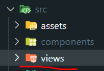

# Vue Router 4 學習筆記

主要根據 Vue Router 4 官方文檔整理的學習筆記，方便查閱。

## 官方文檔

> https://router.vuejs.org/ <br> https://router.vuejs.org/zh/

## 安裝 Vue Router

### 1. 基於 Vite 創建新專案

在環境安裝時選擇添加使用 Vue-Router 即可。

```bash
npm create vue@latest
```


Vue Router 相關文件夾：


項目運行結果：


### 2. 現有專案新增安裝

安裝完成後需要自己配置相關文件，參考下面的[基礎配置](#基礎配置)。

```bash
npm install vue-router@4
```


## 基礎配置

### 1. 新增路由頁面文件

在 src 下建立 views 資料夾，通常路由相關的頁面會放置在此。



views 資料夾下新增 Home、About 頁面：

- Home.vue

  ```vue
  <template>
    <h2>Home page</h2>
  </template>
  ```

- About.vue

  ```vue
  <template>
    <h2>About page</h2>
  </template>
  ```


### 2. 創建路由配置文件

在 src 下建立 router 資料夾，並新增 index.js 文件。


設定路由配置 index.js：

> 動態導入(懶加載)相關介紹可以查看此[官方文檔](https://router.vuejs.org/zh/guide/advanced/lazy-loading.html)。

```javascript
import { createRouter, createWebHistory } from 'vue-router';
// 靜態導入
import Home from '@/views/Home.vue';

// 配置路由規則
const routes = [
  {
    path: '/',
    name: 'Home',
    component: Home,
  },
  {
    path: '/about',
    name: 'About',
    // 動態導入(懶加載)
    component: () => import('@/views/About.vue'),
  },
];

// 創建路由實例
const router = createRouter({
  // 指定模式
  history: createWebHistory(import.meta.env.BASE_URL),
  // 設定前面配置的路由
  routes,
});

// 共享路由實例
export default router;
```

### 3. main.js 引入並使用路由實例

```javascript
import { createApp } from 'vue';
import App from './App.vue';
import router from './router';

const app = createApp(App);

app.use(router);

app.mount('#app');
```

### 4. App.vue 內設定路由連結及顯示

Vue Router 提供了 `<router-link>` 及 `<router-view>` 兩個全域註冊的組件：

- `<router-link>` 組件

  創建路由連結，也可以使用 `<RouterLink>`。

  屬性：

  - to -> 跳轉的路由地址，值為字串或一個物件。

  - replace -> 設置後，會調用 `router.replace()` 而不是 `router.push()`。

    > `replace` 沒有歷史紀錄不可返回，`push` 可以返回。

  - active-class -> 設置連結配對後應用的 class，默認為 `router-link-active`。

  - exact-active-class -> 設置連結準確配對時應用的 class，默認為 `router-link-exact-active`。

- `<router-view>` 組件

  **顯示路由切換頁面的地方**，也可以使用 `<RouterView>`。

設置 App.vue：

```vue
<script setup></script>

<template>
  <h1>Hello Vue Router4!</h1>
  <p><strong>Current route path:</strong> {{ $route.fullPath }}</p>

  <nav>
    <router-link to="/">Go to Home</router-link> |
    <router-link to="/about">Go to About</router-link>
  </nav>

  <main>
    <router-view />
  </main>
</template>
```

> 在模板中也可以透過 `$route` 來獲取當前路由資料。

### 5. 運行專案結果


